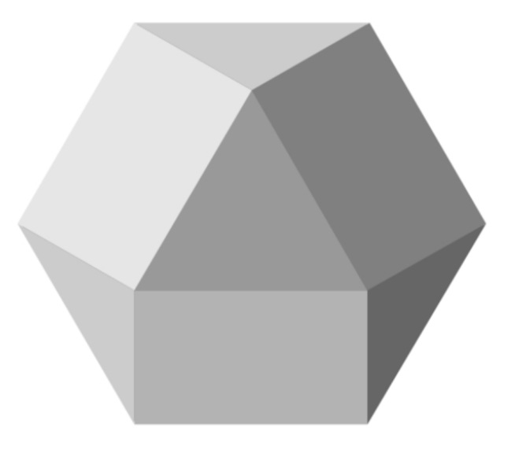

# CyberWay - The Most Powerful Infrastructure for Decentralized Applications

**Welcome to the CyberWay source code repository!**  
**CyberWay is a EOS fork with some major improvements**  

[

## Getting Started

### More information about CyberWay

  - [Main features of CyberWay](https://steemit.com/cyberway/@golos/cyberway-need-for-new-platform)
  - [RoadMap](https://steemit.com/cyberway/@golos/cyberway-project-roadmap)
  - [Bandwidth implementation](https://docs.google.com/document/d/1Kmlgu8pf8YytpVZajj2Si86ZNegkbZg0QHopdACmv6Q/edit?ts=5cb7079a)
  - [Testnet. Installation Guide for Block Producers](https://github.com/GolosChain/cyberway/blob/master/docs/TestnetBlockProducerHowTo.md)

## Community

* Join us on the [CyberWay Discourse]().

## License

[MIT](./LICENSE)

## Important

See LICENSE for copyright and license terms. Block.one makes its contribution on a voluntary basis as a member of the CyberWay community and is not responsible for ensuring the overall performance of the software or any related applications. We make no representation, warranty, guarantee or undertaking in respect of the software or any related documentation, whether expressed or implied, including but not limited to the warranties or merchantability, fitness for a particular purpose and noninfringement. In no event shall we be liable for any claim, damages or other liability, whether in an action of contract, tort or otherwise, arising from, out of or in connection with the software or documentation or the use or other dealings in the software or documentation.  Any test results or performance figures are indicative and will not reflect performance under all conditions.  Any reference to any third party or third-party product, service or other resource is not an endorsement or recommendation by Block.one.  We are not responsible, and disclaim any and all responsibility and liability, for your use of or reliance on any of these resources. Third-party resources may be updated, changed or terminated at any time, so the information here may be out of date or inaccurate.

