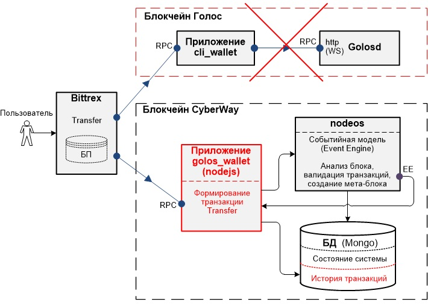

*Настоящее описание кошелька `golos_wallet` предназначено для разработчиков платформы CyberWay, приложений платформы CyberWay, а также пользователей блокчейна Golos, заинтересованных в поддержке и сопровождении приложения Golos на платформе CyberWay.* 

## Функциональные возможности cli_wallet блокчейна Голос
Приложение `cli_wallet`, используемое в блокчейне Голос, представляет собой программный продукт — кошелек, работающий в интерактивном консольном режиме. 
 
Приложение `cli_wallet` можно вызвать в режиме демона, задав в командной строке опцию `–rpc-endpoint`. При запуске в таком режиме `cli_wallet` обрабатывает `json-rpc` запросы. Ответы `cli_wallet` формирует также в формате `JSON`.  
 
## Необходимость в разработке нового кошелька для платформы CyberWay
Основное направление биржи криптовалют Bittrex — покупка и продажа криптовалют. Биржа Bittrex хранит данные аккаунтов и их балансов в своей собственной базе пользователей. Для взаимодействия с различными блокчейнами Bittrex адаптирует свое программное обеспечение. В частности, Bittrex взаимодействует с блокчейнами, созданными на базе логики Steemit, через приложение `cli_wallet`. Для поддержки интерфейса с приложением `cli_wallet` биржа Bittrex использует специальную оболочку, собственной разработки. 
 
Приложение `cli_wallet` является оберткой вокруг библиотек блокчейна Голос. Адаптирование данного приложения под блокчейн другой архитектуры (например, по CyberWay) не представляется возможным.  

Кошелек `cleos`, являющийся кошельком блокчейна CyberWay, архитектурно реализован по другому. Данный кошелек должен быть универсальным для всех приложений блокчейна CyberWay и встраивание в него протокола (аналогичного `cli_wallet`) для отдельного приложения может вызвать проблемы в будущем . Поэтому адаптирование кошелька `cleos`, в силу архитектуры самого блокчейна CyberWay, под протокол `cli_wallet` также является технически сложным решением. 

Поэтому разработчиками CyberWay было принято решение о создании нового кошелька, аналогичного `cli_wallet`, но адаптированного к архитектуре CyberWay. Данный кошелек должен обеспечить взаимодействие Bittrex с приложением Голос на блокчейне CyberWay. 
 
## Требования к новому кошельку для платформы CyberWay
Новый кошелек (далее — `golos_wallet`), обеспечивающий взаимодействие биржи Bittrex с приложением Голос на платформе CyberWay, должен удовлетворять следующим требованиям:  
* интерфейс кошелька `golos_wallet` с Bittrex должен соответствовать интерфейсу `cli_wallet` с Bittrex;  
* интерфейс с пользователем должен быть сохранен. Несмотря на то, что смарт-контракты и кошелек будут взаимодействовать по другим транзакциям, пользователь не должен почувствовать различие в формировании запроса;  
* кошелек `golos_wallet` должен обеспечить поддержку фильтра для получения истории транзакций;  
* кошелек `golos_wallet` должен обеспечивать прием, обработку запросов с выдачей результата в соответствии с форматом JSON;  
* кошелек `golos_wallet` должен функционировать в режиме удаленного вызова с использованием API.  

В первой версии блокчейна CyberWay приложение `golos_wallet` должно поддерживать перечень операций, приведенных в разделе 6 (поддержка остальных операций в первой версии CyberWay не предусмотрена).

## Описание технического решения
Кошелек `golos_wallet` реализован в виде приложения, содержащего набор скриптов на `nodejs`. Логика приложения представляет собой эмуляцию кошелька `cli_wallet`. Также как и в `cli_wallet` запросы от Bittrex в формате JSON поступают на rpc-порт (англ. remote procedure call). Запрос содержит необходимый массив параметров для выполнения конкретной операции. Операции выполняются так, как если бы их выполнение было в консоли.  
Кошелек `cli_wallet` можно использовать через отправление API-запроса на rpc-порт. Выполнение происходит в автоматизированном режиме. 
Для хранения информации о транзакциях с трансферными операциями база данных Mongo дополнена таблицей истории транзакций.  
 
Структурная схема взаимодействия Bittrex с приложениями `cli_wallet` и `golos_wallet`, а также взаимодействие `golos_wallet` с компонентами узлов блокчейна приведена на следующем рисунке.  

  
 
В верхней части схемы (выделено красной пунктирной линией) показано взаимодействие `cli_wallet` с Bittrex и с демоном блокчейна Голоса (Golosd). Нижняя часть схемы представляет техническое решение реализации кошелька `golos_wallet` на блокчейне CyberWay. Выделенные части схемы в красном — новые компоненты CyberWay, реализующие кошелек.  
 
Приложение `golos_wallet` принимает запрос и формирует транзакцию с трансферами. Сформированная транзакция передается на один из сервисов `nodeos`, где она проверяется на валидность. В сервисе `nodeos` размещается событийная модель (от англ. event engine), которая генерирует события. На его вход из сети поступают блоки и транзакции. Выполняется анализ их содержимого (от англ. parsing), формируются события и мета-блок, куда помещается вся результирующая информация.  
 
Приложение `golos_wallet` получает от компонента `nodeos` сформированный мета-блок через порт ЕЕ — представляющий собой плагин узла (ноды) CyberWay, который формирует пакеты в формате JSON и рассылает их своим подписчикам. Логика `golos_wallet` выделяет из получаемого мета-блока только данные о трансферах и сохраняет их в БД в таблице истории транзакций. (Следует заметить, что сформированная транзакция с трансферной операцией сохраняется в истории не сразу, а только после того, как она отправится в сеть и появится в одном из блоков, подписанным блок-продюсером. Последнее будет означать, что данная транзакция валидная может быть сохранена в истории). Для Bittrex важна информация о транзакциях с трансферными операциями, включенными в конкретные блоки и сохраненными в истории транзакций. Bittrex через кошелек периодически обращается в историю транзакций для получения информации о выполненных трансферах.  
 
## Описание операции transfer с использованием golos_wallet
Биржа Bittrex предоставляет возможность пользователю обменять токены одного блокчейна на токены другого блокчейна, а также совершить обмен токенов блокчейна на другую криптовалюту (например, на биткоины). Для выполнения трансферной операции пользователь заходит на веб-сайт Bittrex и создает операцию на перевод средств со своего кошелька на кошелек Bittrex, указав в транзакции свой ключ. Логика bittrex формирует запрос вида transfer с указанием имени аккаунта, количества переводимых средств. Запрос поступает на rpc-порт кошелька `golos_wallet`. В кошельке формируется транзакция с операцией transfer, именем аккаунта и его подписью. Сформированная транзакция отправляется в компонент nodeos, где выполняется базовая проверка данных, в том числе проверка на существование аккаунта и на совпадение подписи. Необходимую информацию для выполнения проверки компонент nodeos получает из БД состояния системы.  
 
Как только в порт ЕЕ компонента `nodeos` отправится сформированный мета-блок, содержащий транзакцию с операцией `transfer`, приложение `golos_wallet` выделит из него информацию о транзакции, блоке, в котором она находится, и сохранит полученные данные таблице истории транзакций.  
 
Для контроля всех трансферных операций биржа Bittrex через `golos_wallet` периодически обращается в БД (mongo) для получения истории транзакций. По указанному ключу в транзакции биржа Bittrex в своей базе пользователей определяет имя аккаунта, от которого поступили средства на баланс биржи. 
 
## Операции, поддерживаемые кошельком golos_wallet
### Операция info
Операция `info` используется для получения информации о блоке. Сигнатура операции имеет вид:  
```cpp
variant wallet_api::info()const 
```
 
Операция `info` не имеет входных параметров. Перечень получаемой информации:  
`virtual_supply` — виртуальный запас;  
`current_supply` — текущий запас;  
`verage_block_size` — средний размер блока;  
`maximum_block_size` — максимальный размер блока;  
`last_irreversible_block_num` — последний необратимый номер блока;  
`hardfork_version` — версия блокчейна;  
`head_block_num` — актуальный номер блока;  
`head_block_id` — идентификатор блока;  
`head_block_age` — время жизни блока (в секундах).  
 
 
### Операция transfer
Операция `transfer` используется для перевода средств с кошелька одного аккаунта в кошелек другого. Сигнатура операции имеет вид:  
```cpp
annotated_signed_transaction wallet_api::transfer(
    string from,
    string to,
    asset amount,
    string memo,
    bool broadcast
)
```
Параметры:  
`from` — имя аккаунта, с кошелька которого будут переводиться средства;  
`to` — имя аккаунта, в кошелек которого будут переводиться средства;  
`amount` — сумма переводимых средств;  
`memo` — запись в транзакции, зашифрованная публичным ключом «memo»;  
`broadcast` — «true», если транзакция пересылается на демон.  

 
 
### Операция list_accounts
Операция `list_accounts` используется для получения списка всех аккаунтов, зарегистрированных в блокчейне. Сигнатура операции имеет вид:  
```cpp
vector< account_name_type > wallet_api::list_accounts(
    const string& lowerbound,
    uint32_t limit
) 
```
Параметры:  
`lowerbound` — имя первого возвращаемого аккаунта. Если такое имя отсутствует, список будет начинаться с имени, непосредственно следующего за `lowerbound`;  
`limit` — значение, ограничивающее количество выводимых на монитор имен аккаунтов. Максимальное значение — 1000.  
 
Задание параметров `lowerbound` и `limit` позволяет формировать страницу в удобном для просмотра виде. Для просмотра всего списка имен аккаунтов рекомендуется вначале значение `lowerbound` устанавливать в виде пустой строки (“”). Затем на каждой итерации параметру `lowerbound` передавать последнее возвращаемое имя аккаунта для следующего вызова `list_accaunt()`. Возвращает список всех зарегистрированных в блокчейне имен аккаунтов с соответствующими им идентификаторами. Список отсортирован по именам в алфавитном порядке. 
 
### Операция list_my_accounts
Операция `list_my_accounts` используется для получения информации об аккаунтах с помощью личного ключа, имеющегося в кошельке. Кошелек должен быть предварительно разблокирован. Операция не имеет входных параметров. Сигнатура операции имеет вид:
```cpp
vector< golos::api::account_api_object > wallet_api::list_my_accounts() 
```
 
### Операция import_key
Операция `import_key` используется для импорта личного ключа в формате WIF в кошелек для его дальнейшего использования аккаунтом при подписании транзакций. Сигнатура операции имеет вид:
```cpp
bool import_key(string wif_key) 
```
Параметр:  
`wif_key` — личный ключ в формате WIF.  
 

Пример использования операции:  
```
import_key 5KQwrPbwdL6PhXujxW37FSSQZ1JiwsST4cqQzDeyXtP79zkvFD3
```
### Операция get_account_history()
Операция `get_account_history` используется для получения истории транзакций для аккаунта. Сигнатура операции имеет вид:  
```cpp
map< uint32_t, golos::plugins::operation_history::applied_operation >
wallet_api::get_account_history(
    string account,
    uint32_t from,
    uint32_t limit
)  
```

Параметры:  
`account` — имя аккаунта, история которого запрашивается;  
`from` — порядковый номер операции.  Параметр является произвольным, по умолчанию принимает значение «-1» — последний номер операции;  
`limit` — максимальное количество запрашиваемых операций. Принимает целочисленное значение от 0 до 1000. Параметр является произвольным, по умолчанию принимает значение «100».  

Пример вызова операции `get_account_history`:
```
get_account_history cyberfounder -1 100
```

### Операция filter_account_history
Операция `filter_account_history` используется для получения истории транзакций для аккаунта, отфильтрованной по определенным признакам. Сигнатура операции имеет вид:
```cpp
history_operations filter_account_history(
    string account,
    uint32_t from,
    uint32_t limit,
    account_history_query query
)
```
Параметры:  
`account` — имя аккаунта, история которого запрашивается;  
`from` — порядковый номер запрашиваемых операций. Параметр является произвольным, по умолчанию принимает значение «-1» — последний номер операции;  
`limit` — максимальное количество запрашиваемых операций. Принимает целочисленное значение от 0 до 1000. Параметр является произвольным, по умолчанию принимает значение «100»;  
`query` — параметр в виде структуры, содержащей признаки, по которым выполняется фильтрация. Содержит следующие поля:  
`select_ops` — перечень операций, которые необходимо получить. Значение может содержать имена операций (в том числе оканчивающие на «_operation»), а также ключевые слова:  
    * `ALL` — все операции;  
    * `REAL` — только операции явно заданные;  
    * `VIRTUAL` — только виртуальные операции;  
`filter_ops` — перечень операций, которые следует исключить. Принимает те же значения, что и `select_ops`. Это поле является произвольным и по умолчанию принимает значение пусто;  
`direction` — «направление» операции относительно аккаунта (например, операция `vote` определяет двух аккаунтов: того, кто голосует и того, за чей пост голосуют). Это поле является произвольным и принимает следующие значения:  
    * `any` — отсутствие направления фильтрации (значение по умолчанию);  
    * `sender` — характеризует аккаунта как отправителя (например, `creator` или `voter`);  
    * `receiver`— характеризует аккаунта как получателя (например, `created` или `voted`);  
    * `dual` — характеризует аккаунта как отправителя и получателя одновременно (например, `voting self post` или операция неоднозначно определяющая аккаунта).  

Операция может быть вызвана с одним заданным параметром (например, `filter_account_history(account)`) для получения 100 последних операций аккаунта.  

Примеры вызова `filter_account_history()`:
```shell
filter_account_history cyberfounder -1 100 {"select_ops":["REAL","interest"], "filter_ops":["transfer"]}

filter_account_history cyberfounder -1 100 {"direction":"receiver","filter_ops":["producer_reward"]}
```
****


  