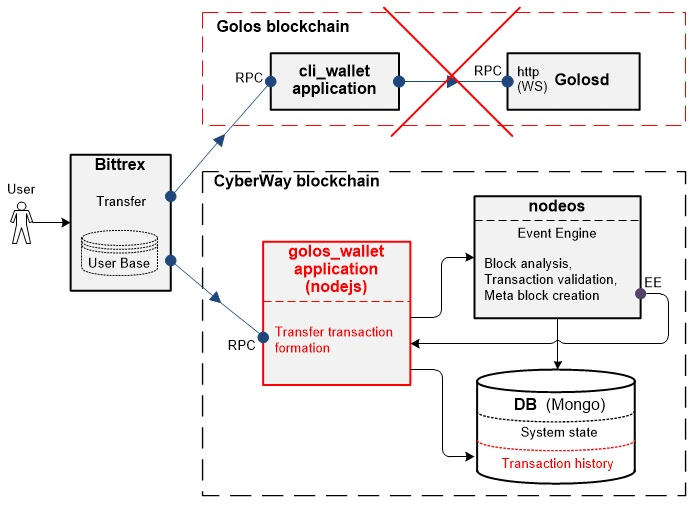

# The cyberway_wallet designed for the Bittrex market

## Annotation
*This `cyberway_wallet` wallet description is designated to developers of CyberWay platform and applications running on CyberWay platform, as well as users of Golos blockchain interested in maintaining and contributing to Golos application functioning on CyberWay platform.*
 
## 1 Functional features of cli_wallet operating on Golos blockchain
The cli_wallet application used in Golos blockchain is a software product — i.e. a wallet running in an interactive console mode.  
 
The `cli_wallet` application can be called in daemon mode by specifying the option `–rpc-endpoint` in the command line. The `cli_wallet` processes `json-rpc` requests when launched in this mode. The `cli_wallet` responses are also generated in the `JSON` format.

## 2 The need to develop a new wallet for the CyberWay platform
Due to transferring of Golos application to the new Blockchain, CyberWay, Golos  developers decided to create a new wallet for Bittrex Exchange, similar to `cli_wallet`, but adapted to the CyberWay architecture. This wallet should allow Bittrex to interact with Golos application on the CyberWay blockchain.  

The main direction of the Bittrex cryptocurrency exchange is purchase and sale of cryptocurrencies. Bittrex Exchange stores account data and their balances in its own user base. Bittrex adapts its software to interact with various blockchains. In particular, Bittrex interacts with blockchains created on the basis of the Steemit/Golos logic through the application `cli_wallet`. To support the interface with the `cli_wallet` application, Bittrex Exchange uses a proprietary special shell.  
 
The app `cli_wallet` is a wrapper around Golos blockchain libraries. Adaptation of this application to another architecture (for example, to CyberWay) is not possible.  

The `cleos` wallet, which is CyberWay’s blockchain wallet, is architecturally different. This wallet should be universal for all CyberWay blockchain applications and embedding a protocol in it (similar to `cli_wallet`) for the Exchange may cause problems in the future. Adapting the `cleos` wallet to the `cli_wallet` protocol is also a technically complex decision.

## 3 New CyberWay wallet requirements

The new wallet (hereinafter named as `cyberway_wallet`) which provides the interaction of the Bittrex Exchange with Golos running on CyberWay blockchain must meet the following requirements:
* the interface of the `cyberway_wallet` with Bittrex must correspond to the Bittrex `cli_wallet` interface;
* the user interface should be saved. Despite the fact that smart contracts and the wallet will interact with other transactions, the user mustn’t feel the difference while forming the request;
* the `cyberway_wallet` wallet should provide filter to support retrieving of the transaction history;
* the `cyberway_wallet` should provide reception, processing of the requests and output of results in JSON format
* the `cyberway_wallet` should function in the remote call mode using the API.  

In the first version of CyberWay blockchain, the application `cyberway_wallet` must support a list of operations listed in section 6 (support of other operations in the first version of CyberWay is not provided).

## 4 Description of the technical solution
The `cyberway_wallet` wallet is implemented as an application containing a set of scripts on `nodejs`. The application logic is an emulation of the `cli_wallet` wallet. As well as in `cli_wallet`, remote procedure calls from Bittrex in JSON format are sent to the rpc-port. The request contains the necessary array of parameters to perform a specific operation. Operations are performed as if they were executed in the console.  

The cli_wallet wallet can be used by sending an API request to the rpc port. The execution occurs in the automated mode. To store information about transactions with transfer operations, the Mongo database is supplemented with a transaction history table.  
 
The block diagram of the interactions of Bittrex with the `cli_wallet` and `cyberway_wallet` applications, as well as the interactions of the `cyberway_wallet` with the components of the blockchain nodes is shown in fig.1  

  

The interaction between `cli_wallet`, Bittrex and Golos daemon (Golosd) is pictured at the top of the fig.1 (highlighted with a red dotted line). The lower part of the scheme represents a technical solution for `cyberway_wallet` implementation on CyberWay blockchain. The highlighted parts of the scheme in red speak of the new CyberWay components that comprise the wallet.  
 
The application `cyberway_wallet` accepts the request and forms a transaction with transfers included. The generated transaction is transferred to one of the `nodeos` services where it gets verified for its validity. Also, there is an event engine in `nodeos` service which is responsible for generating events. The blocks and transactions come to it from the network. Parsing happens here, as well as the formation of events and a meta-block, which compounds all the resulting information.  
 
The application `cyberway_wallet` receives a formed meta-block from the `nodeos` component through the Event Engine port — a CyberWay node plug-in creating packages in JSON format and sending them to its subscribers. The logic of `cyberway_wallet` extracts only transfer data from the received meta-block and stores them in a database in the transaction history table (important: the formed transaction is not instantly saved with the transfer operation in history, only after it’s gone to the network and emerged in one of the blocks signed by the producer block; the latter means that this transaction is valid and can be saved in data base). The information about transactions and transfer operations included in specific blocks and stored in the transaction history is crucial to Bittrex. Bittrex is regularly accessing transaction history in order to obtain the information about the transfers performed.

## 5 Description of the transfer operation while using cyberway_wallet
The Bittrex exchange allows the user to perform the exchange of tokens of one blockchain for tokens of another as well as to exchange blockchain tokens for any other cryptocurrency (e.g., bitcoins). In order to commit a transaction, a user proceeds to the Bittrex website and creates an operation to transfer funds from his wallet to the Bittrex wallet, specifying his key in the transaction. The bittrex logic generates a `transfer` request with the account name and the number of funds desired to be transferred. The request goes to the rpc-port of the `cyberway_wallet` wallet. A transaction is formed in the wallet with a ‘transfer’ operation, the name of the account and its signature. The generated transaction is sent to the nodeos component, where basic data verification is performed including checking of an account presence and a signature match. The nodeos component receives all the information necessary to perform the verification from the state system database.  
 
As soon as the generated meta block containing the transaction with the transfer operation is sent to `nodeos` to Event Engine port, the application `cyberway_wallet` extracts the transaction information from it and identifies the block in which it is located, and saves the received data to the transaction history table.  
 
All transfer operations are controlled when the Bittrex regularly contacts the database (Mongo) through `cyberway_wallet` to get transaction history. Using the specified key in the transaction, the Bittrex Exchange determines the user account in the database from which funds have come to the exchange balance.

## 6 Operations supported by cyberway_wallet wallet in the first release of CyberWay
### 6.1 Operation info
The `info` operation is used to extract the information about a block. The operation signature is the following:
```cpp
  variant wallet_api::info() const
```
 
The `info` operation has no input parameters. The list of information received:  
`virtual_supply` — virtual supply;  
`current_supply` — current supply;  
`verage_block_size` — average block size;  
`maximum_block_size` — maximum block size;  
`last_irreversible_block_num` — the last non-reversible block number;  
`hardfork_version` — blockchain version;  
`head_block_num` — current block number;  
`head_block_id` — block identifier;  
`head_block_age` — a block’s lifetime (in seconds).  


### 6.2 Transfer operation
The `transfer` operation is used when transferring the funds from one account’s wallet to the wallet of another. The operation signature is the following:

```cpp
  annotated_signed_transaction wallet_api::transfer (
      string from,
      string to,
      asset amount,
      string memo,
      bool broadcast
  )
```

Parameters:  
`from` — the name of the sender account from which the funds will be transferred;  
`to` — the name of the recipient account;  
`amount` — the amount of funds transferred;  
`memo` — transaction record, encrypted with the public «memo» key;  
`broadcast` — true if the transaction is sent to the daemon.
  

 
 
### 6.3 List_accounts operation
The `list_accounts` operation serves to get a list of all the accounts ever registered in the blockchain. The operation signature is:
```cpp
  vector< account_name_type > wallet_api::list_accounts(
      const string& lowerbound,
      uint32_t limit
  ) 
```

Parameters:  
`lowerbound` — the name of the first account returned. If there is none, the list will begin with the very first name followed by `lowerbound`;  
`limit` — a value that limits the number of account names displayed on the monitor. The maximum value is 1000.  
 
Setting the `lowerbound` and` limit` parameters allows you to have a page in the best viewable form. It is recommended to set first the value of `lowerbound` as an empty string (“”) to review the entire list of account names. Also, the last account name returned for the next call to `list_account()` should be transmitted to `lowerbound` parameter at each iteration.
It helps to returns a list of all account names registered in the blockchain with their corresponding identifiers. The list is filtered by name in an alphabetical order.

 
### 6.4 List_my_accounts operation
The `list_my_accounts` operation is used to retrieve account information using the private key in the wallet. Please note that the wallet must be pre-unlocked. The operation has no input parameters. The operation signature is:
```cpp
  vector <golos::api::account_api_object> wallet_api::list_my_accounts()
```


### 6.5 Import_key operation
The operation `import_key` is used for a public private key in WIF format. The operation signature is the following:
```cpp
  bool import_key(string wif_key) 
```


Parameter:  
`wif_key` — private key in WIF format.  


Operation example:  
```
  import_key 5KQwrPbwdL6PhXujxW37FSSQZ1JiwsST4cqQzDeyXtP79zkvFD3
```

### 6.6 Get_account_history() operation
The `get_account_history` operation is used to get the transaction history for an account. The operation signature is the following:
```cpp
  map< uint32_t, golos::plugins::operation_history::applied_operation >
  wallet_api::get_account_history(
      string account,
      uint32_t from,
      uint32_t limit
  )  
```

Parameters:  
`account` — the name of the account whose history is being requested;  
`from` — the serial number of the operation. The parameter is arbitrary and it’s default value is «-1» — the last operation number;  
`limit` — the maximum number of operations requested. The value spans from 0 to 1000. The parameter is arbitrary and it’s default value is «100».  


An example of `get_account_history` operation call:
```cpp
  get_account_history cyberfounder -1 100
```

### 6.7 Операция filter_account_history
The `filter_account_history` operation is used when retrieving the transaction history for an account filtered by certain attributes. The operation signature is the following:
```cpp
  history_operations filter_account_history(
      string account,
      uint32_t from,
      uint32_t limit,
      account_history_query query
  )
```
Parameters:  
`account` — the name of the account whose history is being requested;
`from` — the serial number of the operation. The parameter is arbitrary and it’s default value is «-1» — the last operation number;
`limit` — the maximum number of operations requested. The value spans from 0 to 1000. The parameter is arbitrary and it’s default value is «100». 
`query` — parameter is a structure (object) and contains the following fields:
  * select_ops — list of operations that need to be obtained. The value may contain names of operations (including ending with «_operation»), as well as the following key words:
    * ALL — all operations;
    * REAL — only explicitly defined operations;
    * VIRTUAL — only virtual operations;
  * filter_ops — the list of operations to be deleted. Takes the same values as select_ops. This field is optional and defaults to the empty value;
  * direction — «direction» of operation relative to the account (for example, the operation vote defines two accounts: the first is the one who votes and the second is the one whose post is voted for). This field is optional and takes the following values:
    * any — no filtering by direction (default value);
    * sender — determines the account as a sender (for example, creator or voter);
    * receiver — determines the account as a receiver (for example, created or voted);
    * dual — determines the account as both sender and receiver at the same time (for example, voting self post. That is, the case when account is determined ambiguously).
 


An operation can be called with one specified parameter (for example, filter_account_history (account)) in order to get 100 most recent account operations.

An example of filter_account_history() call:
```cpp
filter_account_history cyberfounder -1 100 {"select_ops":["REAL","interest"], "filter_ops":["transfer"]}

filter_account_history cyberfounder -1 100 {"direction":"receiver","filter_ops":["producer_reward"]}
```
 
## 7 A conclusion
The results of the `cyberway_wallet` test launch on the operations mentioned in section 6 showed that the implemented technical solution ensures the functioning of `cyberway_wallet` in accordance with the requirements of section 3.
