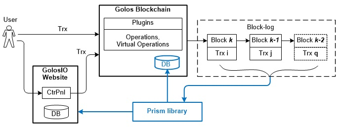
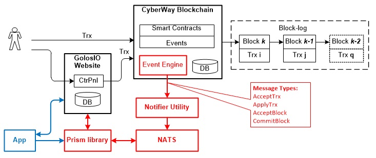

# Event Model
Event model is a separate service subsystem that provides user interaction with the blockchain in terms of collecting information about all events occurring inside the blockchain.  
 
It was developed primarily taking the analysis of the deficiencies of the existing solution in Golos blockchain into account. The analysis results allowed to improve the user interface functionality and allowed us to implement it using affordable and, most importantly, simple solutions.
## Solution existing within Golos blockchain
The user can create and send a transaction in the blockchain both independently and using the website service. Operations existing in the transactions (for example, transfer of funds, accrual of reward, etc.) are processed in the blockchain plug-in methods and also partially in its core. Blockchain forms a chain of blocks in which it places the incoming transactions at its input. Each formed block is added to the chain forming a block-log. Virtual operations can also be created during transactions’ processing (for instance, the operation of closing a post). Virtual operations are not added to the transaction and therefore do not appear in blocks. All information about the state of the system is stored in the blockchain database.  
 
Prism service library has been created for Golos blockchain so that the user would be able to receive up-to-date information on voting for the post, payment of remuneration, transfer operations.This particular library implements the interface between the blockchain and the GolosIO application website. As a result, a user on the website can get all all the information necessary about events occurring in the blockchain (Fig. 1).  
 
  
 
**Structural diagram conventions:**  
  * **Trx** — transaction.
  * **CtrPnl** — control panel of the GolosIO website, provides the user interface for the formation of transactions; contains the necessary keys and settings.
  * **DB** — event storage (Prism library database).
  * Golos Blockchain :
    * **Plugins** — software components used to process operations in transactions;
    * **DB** — internal storage blockchain.
  * **Block-log** — a chain of blocks with transactions packed into them.
  * **Prism** — service library, block-log status analyzer.  

The solution for processing events occurring in the blockchain is highlighted in blue in the diagram.  
 
The Prism library constantly contacts the blockchain database to obtain actual data on the results of the operations performed. The Prism also analyzes the state of the blocks and informs GolosIO about events occurring in the blockchain. Inside GolosIO is an application that stores in its database all information received from the Prism. The Prism has settings and can be configured to transmit only information of interest to users on the website (for example, to transmit only transfer operation-related or only fees-related information).  

## Disadvantages of the event model solution in Golos blockchain
Additional (virtual) operations may be generated in the blockchain during performing the operations specified in the transaction. Information on the results of performing such implicitly specified operations remains inside the blockchain without going beyond. In this case, blockchain remains as a locked space. Information about all events occurring inside it is not received by external consumers as a result of performing additionally generated operations.  
 
The operation of closing a post consumes considerable resources. This operation is created in the blockchain as a virtual one and therefore cannot appear in transactions. Therefore, Prism cannot receive information about the time of closing the post.  
 
In Golos blockchain, the solution to the problem of determining the time for closing a post is based on the reproduction of a chain of blocks. According to the information obtained from the ‘opening a post’ transaction, the course of events is restored, according to which the time of closing the post is determined. This procedure requires a significant resources, including memory and processor time resources.  
 
The lengthy procedure in determining the time for closing a post complicates the logic of calculating the payment of remuneration for a post. The main calculation of rewards is performed in blockchain plugins immediately after closing the post. Since Prism does not receive information about the closure of a post, it has to constantly seek information in the blockchain database to determine the status of the post. At the same time, if the Prism has insufficient data, it is forced to carry out its calculation of rewards, that is, to duplicate it. Moreover, the Prism logic is implemented not in the language of plugins (C ++), but in the JavaScript language. The results of the Prism calculation go to the GolosIO website and they may differ from the results obtained in the plugins that are up to date.  
 
Performing transfer transactions between user balances requires the Prism to constantly turn to the blockchain database to obtain actual data on user balances.  
The main reason for the existing shortcomings in the decision to handle events occurring in Golos blockchain is the inability to transmit information about events in full to Prism. Events such as the results of performing implicitly specified operations or those performed implicitly cannot be transferred to Prism library.  
 
## CyberWay Event model
Aiming to improve the event handling solution in the CyberWay blockchain, we’ve changed the interface between the blockchain and Prism library. Prism library is configured in such a way that it analyzes not the block-log, but the data coming from the system core.  
 
Transactions entering CyberWay's blockchain are processed by smart contracts. The result of processing all operations, including those implicitly specified, is registered as an event and sent to the event engine (hereinafter - EE). The EE plugin for each event received from the smart contract generates a message corresponding to this event. There are four types of messages generated by the EE plugin. Each type stores the information about actions performed explicitly or implicitly.  
 
Saving information about all events directly to the blockchain is an indeed difficult task due to the considerable resources required for this procedure. Therefore, a service component is used to store event information — NATS message broker. Notifier utility is used as an intermediary in the transfer of messages from the EE plugin in NATS.  
 
NATS logs messages and stores the information stored in these messages for a specific time. The duration of the storage period, as well as the type of information accepted for storage, depends on the settings inside the message broker. NATS can be configured in such a way that will allow to accept information only from smart contracts of interest (for example, to save only data on balances or only voting results).  
 
Library Prism asks for information about events in the message broker and sends it directly to the website. An additional application that interacts with Prism and the website can be created to provide with user-friendly information. The structural diagram of transaction processing and receiving information about events is portrayed in Fig.2.  
 
  
 
**Structural diagram conventions:**  
  * CyberWay blockchain:
    * **Events** — operations performed in smart contracts;
    * **Event Engine (ЕЕ)** — plugin that records events occurring in smart contracts;
    * **DB** — blockchain internal storage (State DB).
  * **Notifier Utility** — a specific sublayer that provides receiving messages in EE-format and transmitting them to the NATS message broker.
  * **NATS (NATS message broker)** — open source messaging system.
  * **Prism** — a service library.
  * **App** — an application developed by user.  

The components of the event model are highlighted in red in the diagram.  
Unlike the structural diagram shown in Fig. 1, the solution implemented in CyberWay provides Prism library with information on all the actions performed, including virtual, in smart contracts in full and eliminates the library from constantly accessing the State database for current account data. Consequently, such an event model allows you to provide the user on the application's website with all the information he needs about events occurring in the blockchain.  

## Event Engine
EE is implemented inside the blockchain as a plugin and is the main component of the event model. Events are sent to EE only after the next block is formed.  
 
The plug-in settings specify the list of smart contracts from which events can be received. The purpose of this filtering is to reduce processor resources. Of the entire list of smart contracts, only those of interest are indicated (for example, to perform a transfer operation only, it will be enough to specify the `cyber.token` smart contract).  
 
Depending on the internal settings, EE plug-in can be located on the blockchain nodes in one of two states: active either inactive.  
 
**Recommendations**  
> When in the active state, EE consumes significant processor resources spent on decoding. Therefore, on the nodes of EE validators it should be inactive.  
> 
> When it comes to duplicate nodes EE validators may be in the active state. All messages about what is happening in the system will be recorded in the file transmitted to it, specified in the settings of parameters.  

## Messages generated by Event Engine
EE forms one of these four messages for each event incoming from smart contracts:  
  * **AcceptTrx.** The message is generated for each transaction received by the blockchain and contains information about the created transaction.  

  * **ApplyTrx.** The message is formed after the operation performed from the transaction and contains information about actions and events that occurred during the operation.  

  * **AcceptBlock.** The message appears on each formed block containing transactions. The message informs that the block was received by the validators and sent to the block-log. Blocks located in the block-log can be returned to the blockchain for processing. These blocks can «fall out» of the common chain and create their own history. After this part of the blocks reappears in the block-log, their history will no longer be valid and will be changed. For each block returned to the blockchain, AcceptBlock message also appears.  

  * **Commit block.** The message informs that the block is accepted by the majority of validators, constituting not less than «2/3 + 1» of their total number. The block is sent to the block-log and is non-returnable (last irreversible block). It’s story can not be changed. For each such block created, the message CommitBlock appears.  

All actions that the user requests when forming a transaction automatically transition to EE. This automatically generates the AcceptTrx message and records all actions that are performed in the smart contract, including those implicitly specified and performed implicitly. If necessary, the smart contract can additionally create an event with the appropriate arguments and write it into the resulting structure. Structure fields contain actions that are passed to EE. The events sent from the events field must be described in the ABI-file of this smart contract. The descriptions of events specify a set of arguments.  
 
### Message type AcceptTrx example:

```cpp
{
    "msg_type": "AcceptTrx",
    "id": "ce41f90 … a8a62",  // transaction identifier
    "accepted": true,         // transaction accepted in blockchain
    "implicit": false,        // «true» —  implicit (hidden) transaction
    "scheduled": false        // «true» — deferred transaction
}
```
The message indicates that the blockchain has accepted the transaction with the specified identification number for processing. The presence of «false» in the «implicit» and «scheduled» fields indicates that the accepted transaction is explicitly specified and does not apply to pending.  

### AcceptTrx message type example:
```cpp
{
    "msg_type": "ApplyTrx",
    "id": "56c93f … 3c285",                   // transaction identifier
    "block_num": 8,                           // block sequence number
    "block_time": "2019-04-25T10:01:48.000",  // block creation date/time
    "actions": [                              // actions occurred
        {
            "receiver": "cyber.token",
            "code": "cyber.token",
            "action": "transfer",             // ‘transfer’ action
            "data": "",
            "args": {                         // action arguments
                "from": "cyber",              // sender ID
                "to": "cyber.stake",          // recipient ID
                "quantity": {
                    "amount": 50000000000000, // amount transferred
                    "decs": 4,
                    "sym": "SYS"
                },
                "memo": ""
            },
            "events": [                      // events occurred
                {
                    "code": "cyber.token",   // event code 
                    "event": "balance",      // event: account balance change "cyber"
                    "data": "",
                    "args": {
                        "account": "cyber",  // sender account name
                        "balance": {
                            "amount": 10000192666580,  // balance status 
                            "decs": 4,
                            "sym": "SYS"
                        }
                    }
                },
                {
                    "code": "cyber.token",
                    "event": "balance",      // event: account balance change аккаунта "cyber.stake"
                    "data": "",
                    "args": {
                        "account": "cyber.stake",     // recipient account
                        "balance": {
                            "amount": 50000000000000, // recipient account balance
                            "decs": 4,
                            "sym": "SYS"
                        }
                    }
                }
            ]
        }
    ]
}
```
The message indicates that the `transfer` operation was performed, during the execution of which two events occurred — the balances of the accounts of the sender and the receiver of funds changed.  

### AcceptBlock message type example:
```cpp
{
    "msg_type": "AcceptBlock",
    "id": "00000005 … 78e7c",          // block identifier (ID)
    "block_num": 5,                    // block sequence number
    "block_time": "2019-04-30T16:01:12.000",
    "validated": true,
    "in_current_chain": true,
    "trxs": [                          // transactions listed in the block
        {
            "id": "db85... 19af9e5",   // transaction ID
            "status": "executed",      // transaction completed
            "cpu_usage_us": 12322,     // CPU-resource spent on the transaction
            "net_usage_words": 25      // NET-resource spent on the transaction
        },
        ....
        {
            "id": "cb6cf8b9a5da039dceb913d9713f3d56b6a9da403d2c44135fc55349c0176df9",
            "status": "executed",
            "cpu_usage_us": 54623,	
            "net_usage_words": 2664
        },
        {
            "id": "384afa3778456b8b61ba43622f79b33b4b53fab020e2849aa36255ec7c7cadcc",
            "status": "executed",
            "cpu_usage_us": 45484,
            "net_usage_words": 1099
        },
        {
            "id": "ce41f9032b12ce3e5dbb4bf40c2d3ccb34f0a167f21d65391182f997aa3a8a62",
            "status": "executed",
            "cpu_usage_us": 479120,
            "net_usage_words": 16
        }
    ],
}
```  

The message indicates that a block has been formed and placed in the chain of blocks numbered 5. The block contains transactions with the specified identification numbers. For each transaction, the values of bandwidth resources spent on its execution are given.  

### CommitBlock message type example:
```cpp
{
    "msg_type": "CommitBlock",
    "id": "000000034044... ac178e7c",      // block ID
    "block_num": 3,
    "block_time": "2019-04-30T16:01:12.000",
    "validated": true,
    "in_current_chain": true
}
```
The message informs that the formed block had been received by the validators and placed in the blockchain at number 3.  

## Notifier utility
All event arguments are represented in binary form. In order for the EE plug-in to deserialize such arguments and give the event a structured look, the smart contracts contain an ABI-description of each event transmitted. Using the ABI-description given in the event, the EE plug-in converts the binary view of the received event into a structure form.  
 
The event messages generated by the plug-in are recorded either in the file descriptor or transmitted to the pipeline depending on the settings.  
 
Utility Notifier has been created for sending event messages to NATS message broker.  
 
Notifier opens the `pipeline` line, receives the event and sends it to the NATS. Then the node is started, which transmits to the line all the information about the event.  
 
## NATS message broker
In the basic implementation of the blockchain, information about all events occurring inside it is saved as text into a separate file. The text view is selected to simplify integration. This information cannot be stored in the file for a long time. In order to use it as a story to reproduce previously occurring events, it is necessary to provide free read access to this file and save the read information to a separate repository.  
 
The task of replaying previously occurring events is beyond the scope of EE functions. To support this functionality, a separate service, the NATS message broker, is connected to the event model. This service has settings and ensures that the received information about events is stored on a hard disk with the ability to access this information.  
 
The interaction of the Notifier utility with the NATS message broker is implemented using the NATS settings. The user is given the opportunity, if necessary, to connect other types of message brokers. Connecting the message broker is easy to implement.  
 
## Prism library
Prism Library is a product of the development of the GolOIO team. The library provides the user with information about events that occurred in the blockchain, in a convenient form. The user can also develop his/her own App (shown in Fig. 2 in green) for information about events. The App will be easily implemented with the rest of the system components.  

Information on the implementation of the Prism library to be provided later.  

## Solution merits
Event model provides the most faultless information about all operations in the blockchain, including virtual ones, and provides it in a user-friendly form.  
 
  * *Example 1.* The vesting user purchase operation generates a chain of events implicitly defined, including:
    * transfer of a certain amount from the user's balance to the vesting smart contract;
    * informing the user via vesting smart contract about changes in his/her balance.  

The operations mentioned above are not contained in the transaction and are of the type implicitly specified. Despite that, the user can also receive information about the balance.  
 
The solution allows to exclude appeals of the event model in the State Database (for example, for obtaining data on user balances).  
 
  * *Example 2.* Performing an operation to transfer part of the funds from the balance of one user to the balance of another leads to a change in the data of two balance sheets at once. The `cyber.token` smart contract complements the `transfer` action with `event` events with values of modified balances. In the generated resultant event there will be all relevant information about the transfer operation performed. There is no need to contact the State Database, so that the work of the blockchain is not interrupted.  
****  

