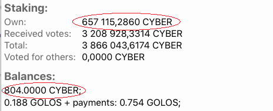
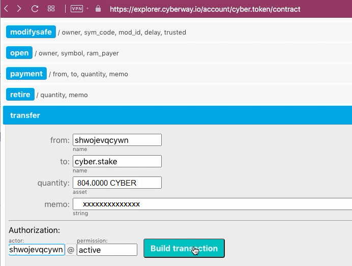

# How To Bay Stake Using CYBER tokens

## Goal
Transfer tokens *CYBER* to stake.

## Steps
The operation can be performed through the contract `cyber.token`.

### Step 1
Go to the page `https://explorer.cyberway.io/account/<account ID>` and specify ID of your account. Let it is *shwojevqcywn*. See balance of this account.  

The field `Own`contains total amount of staked tokens of this account. In addition, there are another 804,0000 CYBER tokens on balance of this account. This amount can be spent on purchase of stake.

### Step 2
Go to the page `https://explorer.cyberway.io/account/cyber.token/contract`.  

### Step 3
Choose the tab `transfer` and fill in fields.

In the field `from`, you have specify the identifier of your account.  

Recipient is the contract `cyber.token`.  

In the field `quantity` it is necessary to set the number of funds transferred, taking into account the required accuracy. For *CYBER* tokens, you must specify four numbers after the point.  

 In `memo` field you have to specify ID of account-recipient. Tokens will be transferred to steak of this account.  

In the field `authorization` you must specify the same identifier of your account.  

### Step 4
Click `Build transaction`.  

### Step 5
Check transaction.  
Make sure the transaction contains correct information.  

### Step 6
Subscribe with your private key and click `Sign transation` to send it on blockchain.
