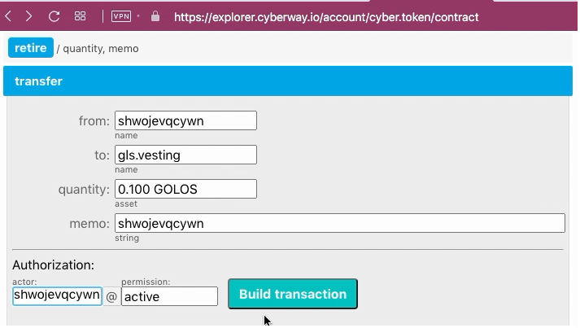

# How To Bay Vesting Using Explorer

### Goal
Transfer tokens *GOLOS* to *Golos Power* using Cyberway Explorer.

## Steps
The operation can be performed through the contract `cyber.token`.

### Step 1
Go to the page `https://golos.io/<@account name>/wallet` and review your token *GOLOS* and *Golos Power* balances.

The field *Golos* displays number of tokens that you can spend to purchase *Golos Power*.

### Step 2
Go to the page `https://explorer.cyberway.io/account/cyber.token/contract`.
In menu that opens, select action `transfer` and fill in the fields.  

**Fields:**
 * `from` - the identifier of your account.
 * `to` - the account of recipient. This is *golos.vesting*.
 * `quantity` - the number of tokens, taking into account the required accuracy. For *GOLOS* tokens, you must specify three numbers after the point.
 * `Memo` - the identifier of your account if you buy tokens for yourself.
 * `authorization` - the same identifier of your account.

### Step 3
Click `Build transaction`.

### Step 4
Check transaction. Make sure the transaction contains correct information.  

### Step 5
Subscribe with your private key and click `Sign transation` to send it on blockchain.

### Step 6
Open the page `https://golos.io/<@account name>/wallet` and check the field *Golos Power* value. It should be increased by the purchase amount in accordance with current exchange rate.