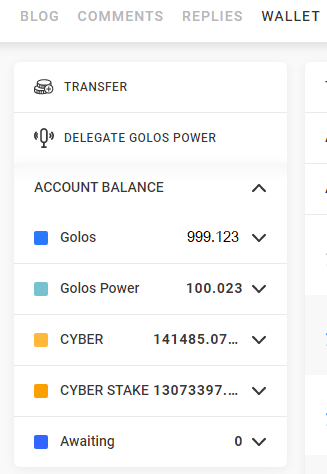
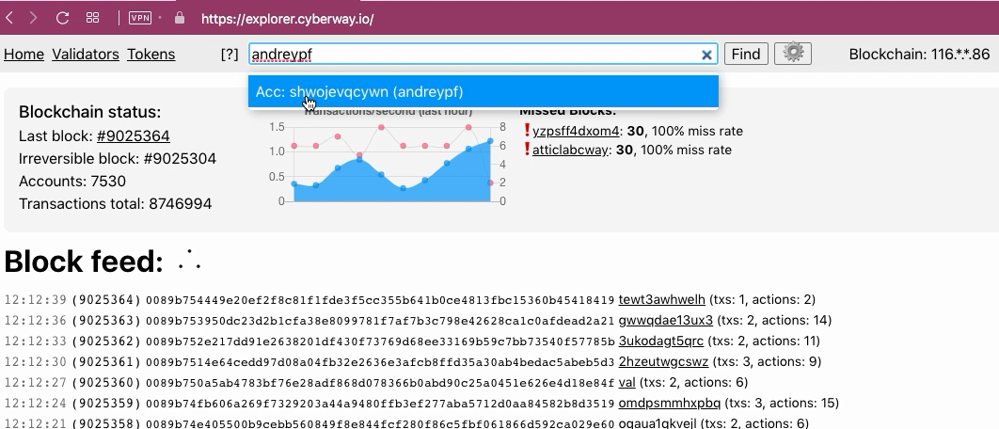
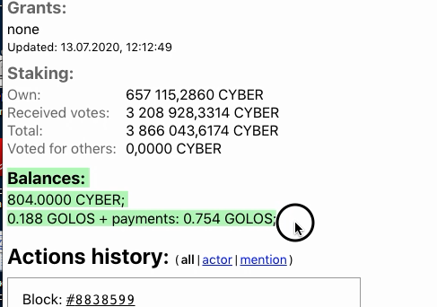

# How To Check Your Balance

## Goal
Check your token balance.

## Steps
The operation can be performed in two ways - using the site `golos.io` and using explorer `cyberway.io`.

### Way 1: Check your balance using the site golos.io

#### Step 1.1
Go to the page `https://golos.io/<account name>`. Let the account name is *golos*.  

#### Step 1.2
Open *wallet* tab. The types of tokens available on account balance will be shown in the left menu.  

The fields at the top of menu indicate actions that can be performed by your account.  

*Golos* and *CYBER* fields are types of tokens that are on your account balance.  

*Golos Power * and *CYBER STAKE* fields are number of staked tokens of *Golos* and *CYBER* respectively.  

*Awaiting* field is number and type of tokens in the state of illiquid.

### Way 2: Check your balance using explorer cyberway.io

#### Step 2.1
Go to the page `https://explorer.cyberway.io/`and specify account name. Please note that different names may be assigned to accounts depending on dApps. Let it i *andreypf*.  

#### Step 2.2
In window that opens, all information about this account will be displayed, including balance.  

You can see the following information:
 * `CYBER` Tokens: 804.0000
 * `GOLOS` Tokens: 0.188
 * `GOLOS` Tokens in the state of illiquid: 0.754

Also, you can see status of the steak:  
`Own` field shows amount of tokens that are available for conversion to` CYBER`. This field is updated after each account action.  

Please note that the explorer does not show `Golos Power` balance, since this type of token is specific and applicable only to dApp Golos. Therefore, explorer it is not available.
