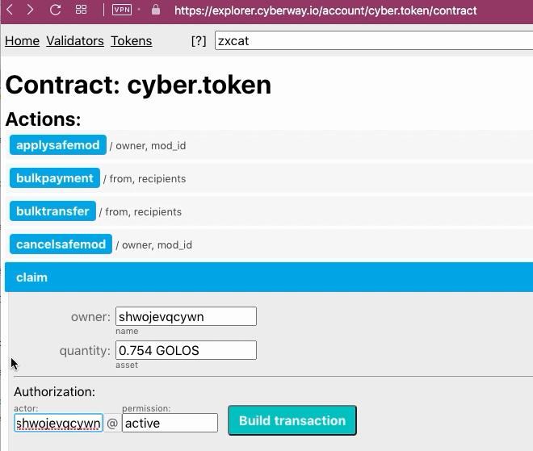
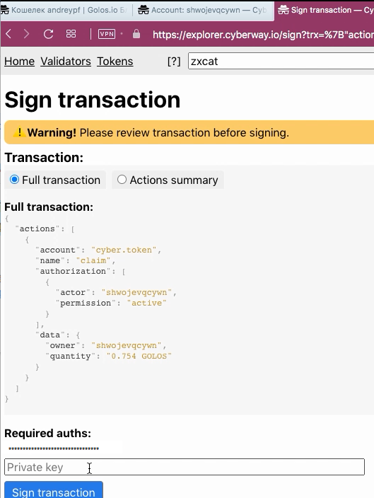

# How To Transfer Funds From Pending to Liquid

### Goal
Transfer tokens from pending to liquid.

## Steps
The operation can be performed through the contract `cyber.token`.

### Step 1
Go to the page `https://explorer.cyberway.io/account/cyber.token/contract` and specify account name. Let it is *zxcat*.  

### Step 2
Open an account balance and determine amount of tokens that need to be made liquid.  

The field `paiments` contains amount of "pending" tokens that is 0.764 GOLOS. This amount is to be transfered to liquid.  

### Step 3

Keep ID of your account. In our case, this is `xhdtonx5zvnd`.  

### Step 4
In menu that opens, select action `claim` and fill in the fields.  

In the `owner` field, you must specify the identifier of your account.  

In the field `quantity` it is necessary to set the number of funds transferred, taking into account the required accuracy. For *GOLOS* tokens, you must specify three numbers after the point, for *CYBER* - four.  

In the field `authorization` you must specify the same identifier of your account.  

### Step 5
Click `Build transaction`.  

### Step 6
Check transaction.

Make sure the transaction contains correct information.  

### Step 7
Subscribe with your private key and click `Sign transation` to send it on blockchain.  

### Step 8
Return to page with account balance again and make sure that the `payment` field has become empty, and amount of liquid tokens has increased by the number of funds transferred.
