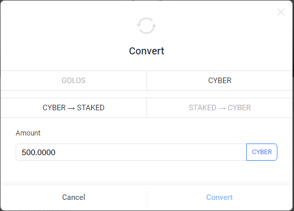

# How To Stake Tokens *CYBER*

## Goal
Stake/unstake the tokens *CYBER*.

## Steps
### Step 1
Go to the page `https://golos.io/<account name>` and open *wallet* tab. Let the account name is *anazarov*.  

### Step 2
Fields at top of the left menu indicate actions that can be performed by the account. Choose the action *convert*.  

In opened window, you can take the conversion action you need.

### Step 3
To stake the tokens *CYBER* you need to click *CYBER* and *CYBER -> STAKED*.  
To unstake the tokens *CYBER* you need to click *CYBER* and *STAKED -> CYBER*..

Amount of tokens *CYBER* is indicated with an accuracy of four characters after the point.  
Operation cannot be performed if there are not enough funds on the account balance. In this case, the message "Insufficient funds" appears.  

### Step 4
Click *Convert* to run the operation.
