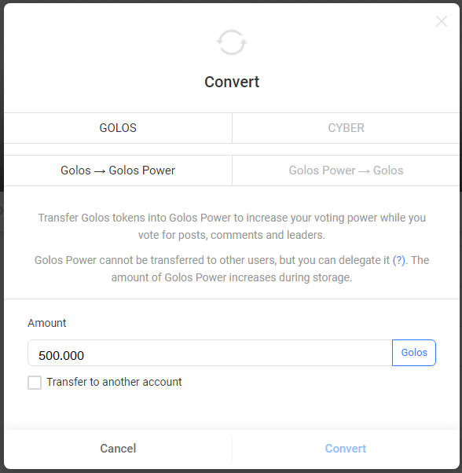

# How To Convert *Golos* To *Golos Power* And Vice Versa

## Goal
Convert the tokens *Golos* to *Golos Power* and vice versa.

## Steps
### Step 1
Go to the page `https://golos.io/<account name>` and open *wallet* tab. Let the account name is *anazarov*.  

### Step 2
Fields at top of the left menu indicate actions that can be performed by the account. Choose the action *convert*.  

In opened window, you can take the conversion action you need.

### Step 3
To convert the tokens *Golos* to *Golos Power* you need to click *Golos* and *Golos -> Golos Power*.  
To convert the tokens *Golos Power* to *Golos* you need to click *Golos* and *Golos Power -> Golos*.  

You have to set amount of tokens *Golos* with an accuracy of three characters after the point.  
Operation cannot be performed if there are not enough funds on the account balance. In this case, the message "Insufficient funds" appears.  

### Step 4
Click *Convert* to run the operation.
