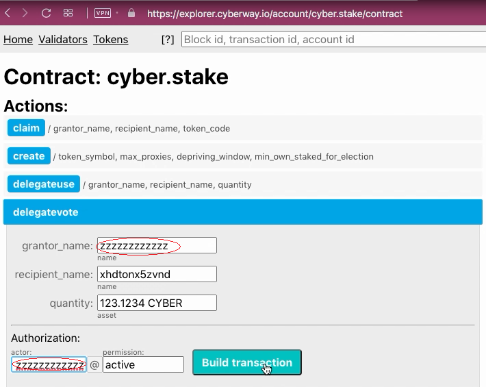
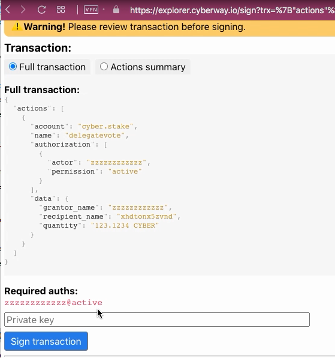

# How To Vote For A Validator

### Goal
Delegate a part of staked tokens to a validator or to proxy account for voting.

## Steps
The operation can be performed through the contract `cyber.stake`.

### Step 1
Go to the page `https://explorer.cyberway.io/account/cyber.stake/contract`.

### Step 2
In menu that opens, select action `delegatevote` and fill in the fields.  

**Fields:**
 * `grantor_name` - the identifier of your account.
 * `recipient_name` — the identifier of a validator or proxy account.
 * `quantity` - an amount of staked tokens transferred, taking into account the required accuracy. For *CYBER* tokens, you must specify four numbers after the point.
 * `authorization` - the same identifier of your account.

### Step 3
Click `Build transaction`.

### Step 4
Review transaction.

Make sure the transaction contains correct information.

### Step 5
Subscribe with your private key and click `Sign transation` to send it on blockchain.
