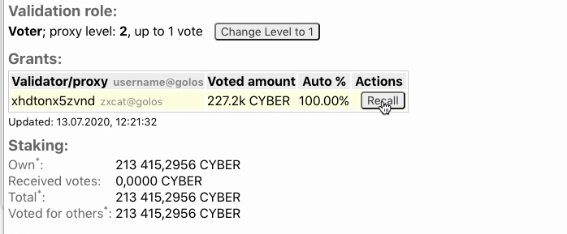
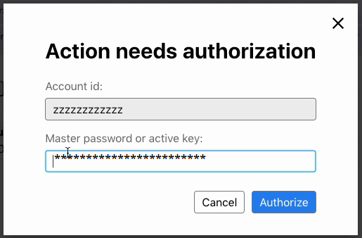
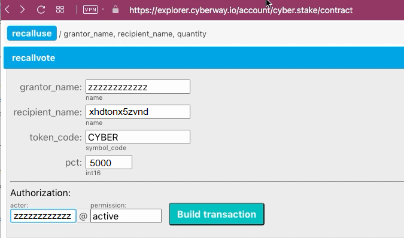

# How To Revoke Your Vote For A Validator

### Goal
Recall the right to use a delegated stake when voting for validators. The steak can be withdrawn partially or completely.  
The operation can be performed in two ways: automatically or manually.

## Way 1: Automatic

### Step 1.1

Go to the page `https://explorer.cyberway.io/account/<account name>`. Let the account name is `zzzzzzzzzzzz`.

### Step 1.2
Review the field `Grants`. This field will display information about staked tokens delegated to  accounts (validators or proxies).  

Click `Recall`.

### Step 1.3
Fill in the fields in window that appears.

Fill in the field in window that appears - sign with your active key.

## Way 2: Manual
The operation can be performed through the contract `cyber.stake`.

### Step 2.1
Go to the page `https://explorer.cyberway.io/account/cyber.stake/contract`.

### Step 2.2
In menu that opens, select action `recallvote` and fill in the fields.  

Fields:
 * `grantor_name` - the identifier of account that withdraws the right to use the stake.
 * `recipient_name` - the identifier of a validator or proxy account from which the right to use the stake is withdrawn.
 * `token_code` - the type of token (just specify *CYBER*).
 * `pct` - share of stake. The value is in percent (5000 corresponds to 50%, 10000 corresponds to 100%).
 * `authorization` - the same identifier of your account.

### Step 2.3
Click `Build transaction`.

### Step 2.4
Review transaction. Make sure the transaction contains correct information.

### Step 2.5
Subscribe with your private key and click `Sign transation` to send it on blockchain.

Note, funds will not be returned immediately, but after a certain time.