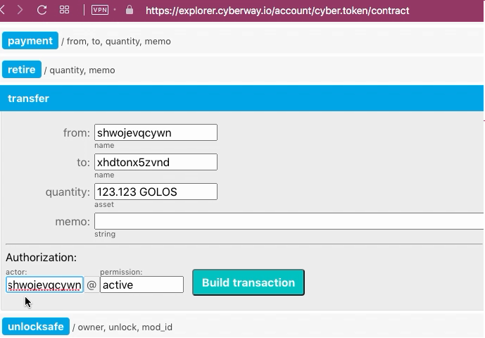
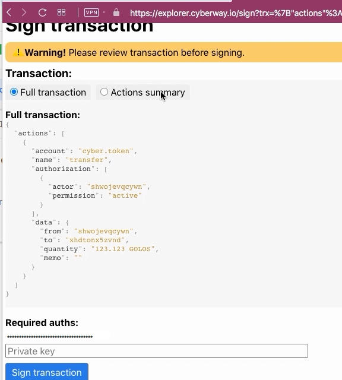

# How To Transfer Funds From One Account To Another

### Goal
Transfer tokens from your balance to another.  
You can also use this operation to transfer funds to an exchange.

## Steps
The operation can be performed through the contract `cyber.token`.

### Step 1
Go to the page `https://explorer.cyberway.io/account/cyber.token/contract` and specify account name. Let it be *zxcat*.  

Also keep ID of the account you are setting. In our case, this is `xhdtonx5zvnd`.

### Step 2
In menu that opens, select action `transfer` and fill in the fields.  

**Fields:**
 * `from` - the identifier of your account.
 * `to` - the recipient's account. If you are unsure of the recipient account ID, you need to get it directly from the recipient user.
 * `quantity` - the number of funds transferred, taking into account the required accuracy. For *GOLOS* tokens, you must specify three numbers after the point, for *CYBER* - four.
 * `Memo` - field is optional to leave a comment.
 * `authorization` - the same identifier of your account.

### Step 3
Click `Build transaction`.

### Step 4
Check transaction.

Make sure the transaction contains correct information.  

### Step 5
Subscribe with your private key and click `Sign transation` to send it on blockchain.
