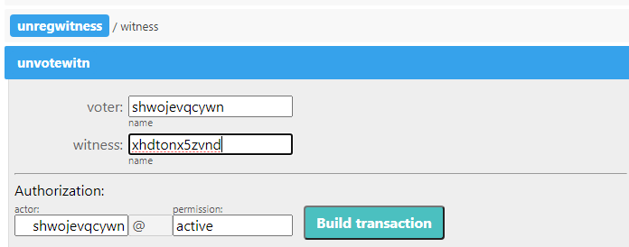

# How To Revoke Your Vote For A Witness

### Goal
Withdraw a previously cast vote for a witness candidate whose activity is suspended.

## Steps
The operation can be performed through the contract `gls.ctrl`.

### Step 1
Go to the page `https://explorer.cyberway.io/account/gls.ctrl/contract`.

### Step 2
In menu that opens, select action `unvotewitn` and fill in the fields.  

**Fields:**
 * `voter` - account ID that that intends to withdraw vote which was previously cast for the witness candidate.
 * `witness` - account ID of the witness candidate for whom the vote is withdrawn.
 * `authorization` - the same account ID that intends to withdraw vote.

### Step 3
Click `Build transaction`.

### Step 4
Review transaction. Make sure the transaction contains correct information.

### Step 5
Subscribe with your private key and click `Sign transation` to send it on blockchain.
