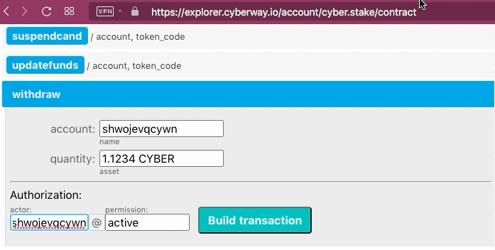

# How To Withdraw Stake

## Goal
Withdraw tokens *CYBER* from stake and make them liquid.

## Steps
The operation can be performed through the contract `cyber.stake`.

### Step 1
Go to the page `https://explorer.cyberway.io/account/<account ID>` and specify ID of your account. Let it is *shwojevqcywn*. See balance of this account.  

The field `Own`contains total amount of staked tokens of this account. Note, only a part of this amount can be withdrawn because a piece of the steak is blocked due to using resources. You should also check whether the staked tokens have been transfered to perform an operation (i.e., transferred to proxy account for voting). 

### Step 2
Go to the page `https://explorer.cyberway.io/account/cyber.stake/contract`.  

### Step 3
Choose the tab `withdrawn` and fill in fields.

**Fields:**
 * `account` - the identifier of your account.
 * `quantity` - the number of funds transferred, taking into account the required accuracy. For *CYBER* tokens, you must specify four numbers after the point.
 * `authorization` - the same identifier of your account.

### Step 4
Click `Build transaction`.  

### Step 5
Check transaction.  
Make sure the transaction contains correct information.  

### Step 6
Subscribe with your private key and click `Sign transation` to send it on blockchain.  
Operation is performed instantly.
