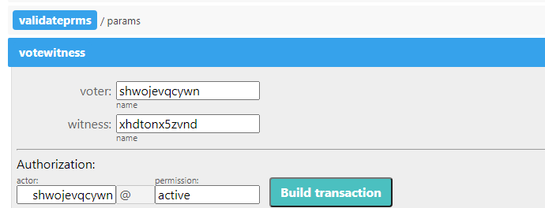

# How To Vote For A Witness

### Goal
Transfer a part of tokens *Golos Power* to vote for a witness candidate.

## Steps
The operation can be performed through the contract `gls.ctrl`.

### Step 1
Go to the page `https://golos.io/<@account name>/wallet` and review your token balance.

The field *Golos Power* displays number of tokens a part of which you can spend on voting for witness.

### Step 2
Go to the page `https://explorer.cyberway.io/account/gls.ctrl/contract`.

### Step 3
In menu that opens, select action `votewitness` and fill in the fields.  

**Fields:**
 * `voter` - account ID that is voting for the witness candidate.
 * `witness` - account ID of the witness candidate for whom the vote is cast.
 * `authorization` - the same account ID that is voting.

### Step 4
Click `Build transaction`.

### Step 5
Review transaction. Make sure the transaction contains correct information.

### Step 6
Subscribe with your private key and click `Sign transation` to send it on blockchain.
