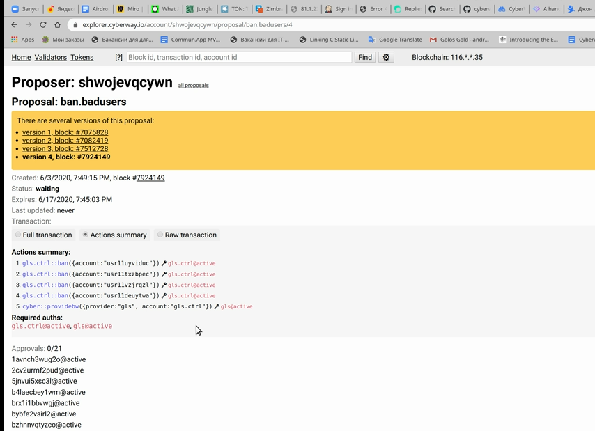

# How To Ban An Unwanted Account

### Goal
Ban an account whose activity may harm the dApp functioning, as well as the blockchain as a whole.

### Before you begin
  * Install the currently supported version of `cleos`.
  * Understand the following:
    * Who is a Golos application leader.
    * What is a [multisig propose transaction](https://docs.cyberway.io/software_manuals/command_reference/multisig#multisig-propose-transaction).

### Steps

**Step 1**  
Identify accounts whose activities are causing a negative reaction. Assume these are: *usr11uyviduc*, *usr11xzbpec*, *usr11vzjrqzl*, *usr11deuytwa*.

**Step 2** Create transactions containing the action *ban* to block each of the listed accounts.
You can call the action *ban* from contract `gls.ctrl` using command line *cleos*.
```sh
$ for i in <account-1> ... <account-n>; do
    cleos --url http://<node> push action gls.ctrl ban '["'$i'"]' --bandwidth-provider gls.ctrl/gls -p gls.ctrl -d -s -x <expiretime> 2>> <file_name.trx>
done
```

*Example*
```sh
$ echo > ban.trx
$ for i in usr11uyviduc usr11xzbpec usr11vzjrqzl usr11deuytwa; do
    cleos --url http://seed-1:8888 push action gls.ctrl ban '["'$i'"]' --bandwidth-provider gls.ctrl/gls -p gls.ctrl -d -s -x 1209600 2>> ban.trx
done
```
The name "i" is a loop parameter which are sequentially assigned the listed accounts.  
To prevent the transaction from becoming `expired` while signatures are being collected, you have to set the transaction expiretime, for example, *14* days that is *1209600* in seconds (*60×60×24×14=1209600*). The maximum allowable time is *45* days.  
Resulting actions code is saved in the file `ban.trx`.  

**Step 3** Edit the file `ban.trx` to put the actions in one transaction.

**Step 4** Retrive a list of active leaders who have right to sign a transaction.  
This list can be retrieved from the *gls* account authorization:
```sh
$ cleos -u http://seed-1:8888 get account -j gls
```
From the result output, select and save the list of actors that will look like:
 

 

**Step 5** Edit the list of active leaders.
Convert the active leaders list to string form like this one `[{"account", "permission"}, ... ,{"account", "permission"}]`.  

*Example*
```sh
[{"actor": "lavnch3wug2o","permission: "active"},{"actor": "2cv2urmf2pud","permission: "active"}, ... ,{"actor": "rtvmqvzi5lvt","permission: "active"}] 
```

**Step 6** Submit the proposal.
The proposal can be submitted by any user. It is created via *propose* taken from the contract `cyber.msig`.  
The command line looks like this one:
```sh
$ cleos -u http://<node> multisig propose_trx <proposal_name> permissions.json <file_name.trx> <proposer> -p <proposer>
```

*Example*
```sh
$ cleos -u http://seed-1:8888 multisig propose_trx ban.badusers permissions.json ban.trx shwojevqcywn -p shwojevqcywn
```

**Step 7** Pass the transaction to leaders for signing.  
The link can be taken from author of the proposal.  

*Example*  
Leaders can go to `https://explorer.cyberway.io/account/shwojevqcywn/proposals/bad.badusers/4` and sign the transaction.  
.

