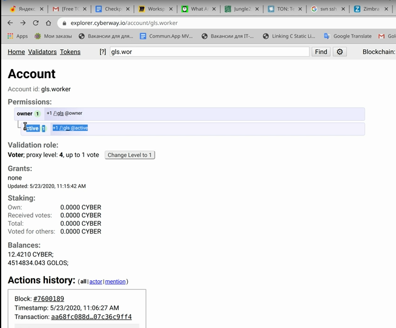
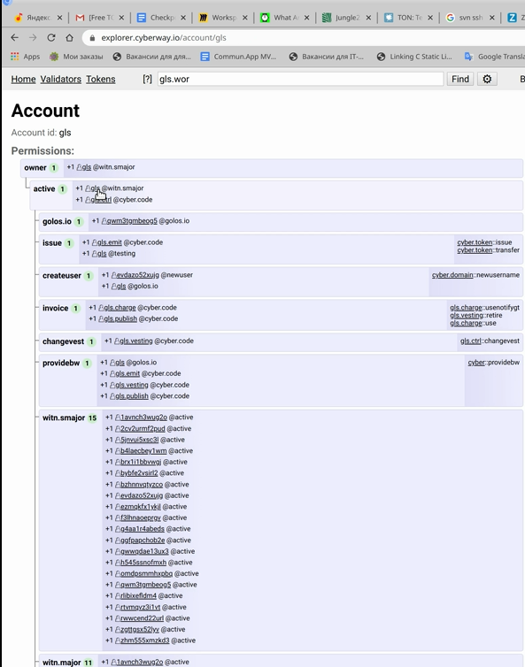
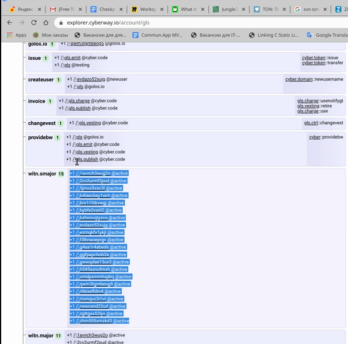
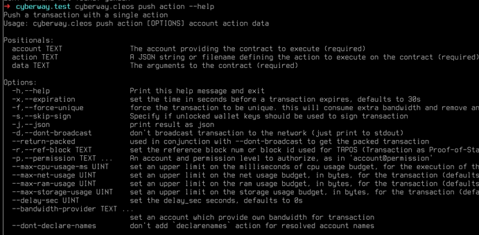
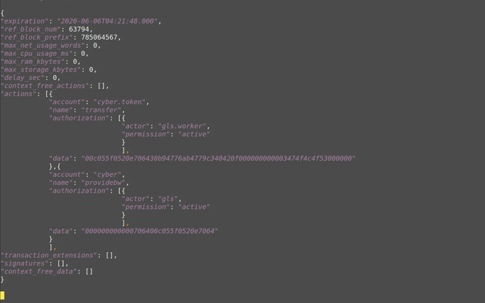
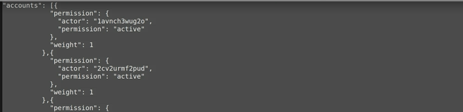
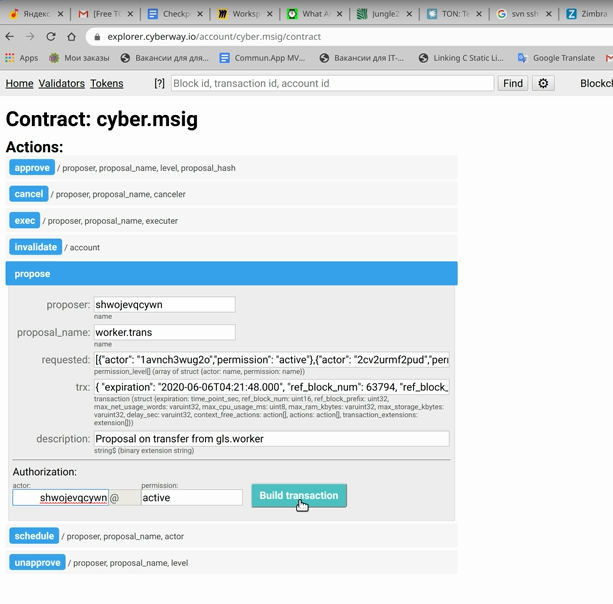
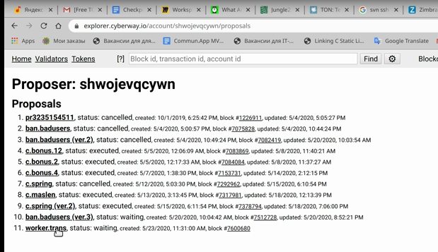
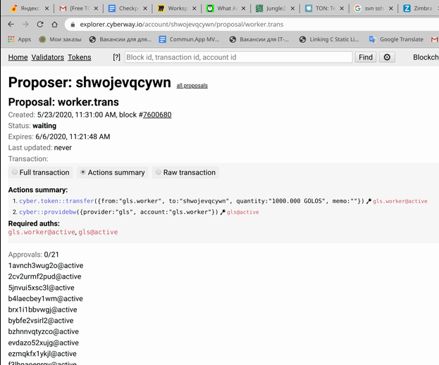

# How To Transfer Tokens To A Worker

### Goal
Create a multi-signature transaction for transferring funds from gls.worker account to a worker to pay for finished work. The transaction should be approved by Golos active leaders.

### Before you begin
  * Install the currently supported version of `cleos`.
  * Understand the following:
    * Who is a worker.
    * Who is a Golos application leader.
    * What is a [multisig propose transaction](https://docs.cyberway.io/software_manuals/command_reference/multisig#multisig-propose-transaction).
  

*Worker* - a user directly performing work in accordance with the statement of work. A user’s account can be an individual or a group of people.

### Steps

**Step 1** Obtain a list of active leaders with the appropriate authority to create (as well to sign) proposal transaction to pay a worker his work.  

Go to `explorer.cyberway.io/account/gls.worker`.  
 

 
In `Permissions` section open the field of active Golos leaders with `gls@witn.smajor` account rights.  
 

 
In the field `active`, account `gls.worker` has an authorization from `gls@active` - that is a list of active leaders. Copy a list of active leaders from `witn.smajor` to a separate place.  
 

 
Signatures of these leaders will be necessary to sign proposal transaction.  

**Step 2** Create proposal transaction using `cleos`.  
To prevent the transaction from becoming `expired` while signatures are being collected, you have to set the transaction expiretime, for example, *14* days that is *1209600* in seconds (*60×60×24×14=1209600*). The maximum allowable time is *45* days.  

For convenience, you can get and use the list of supported options.
```sh
$ cyberway.cleos push action --help
```
 

 
Options are of particular importance: `-x`, `-s` and `-d`.  
The command line looks like:
```sh
$ cyberway.cleos –u http://<node> push action –d –s –x <expiretime> cyber.token transfer '{<gls.worker>, <worker account> , <quantity>, <memo-comment>}' –p gls.worker –bandwidth-provider gls.worker/gls
```
*Example*
```sh
$ cyberway.cleos –u http://seed-1:8888 push action –d –s –x 1209600 cyber.token transfer '{"from":"gls.worker", "to":"shwojevqcywn", "quantity":"1000.000 GOLOS", "memo":""}' –p gls.worker –bandwidth-provider gls.worker/gls
```
*Output*  
 

 
Copy the transaction output code to a separate place.

**Step 3** Form a list of signatories.
```sh
$ cyberway.cleos –u http://seed-1:8888 get account –j gls
```
From the result output, select and save the list of actors that will look like:
 

 
Convert list of actors to string `[{"account", "permission"}, … ,{"account", "permission"}]` :
*Example*
```sh
[{"actor": "lavnch3wug2o","permission: "active"},{"actor": "2cv2urmf2pud","permission: "active"}, ... ,{"actor": "rtvmqvzi5lvt","permission: "active"}] 
```

**Step 4** Create the proposal.  
Go to `explorer.cyberway.io/account/cyber.msig/contract`, open the propose tab and fill in the fields.  
 

 
  * `proposer` – an author of proposal, any user can be (`shwojevqcywn` in our example).
  * `proposal_name` – proposal name (`worker.trans` in our example).
  * `requested` – kept string of signatories [{...}].
  * `trx` – kept transaction code that is {...}.
  * `description` – some comment.

Enter the proposer name in the authorization field.  
Click `build transaction`.  

**Step 5** Sign the transaction with your private key and send a link to the transaction to Golos leaders.
 

 
**Step 6** Check the proposal.  
Go to `explorer.cyberway.io/account/shwojevqcywn/proposals`.
A list of proposals sent by the proposer account will appear, indicating block number and transaction (worker.trans).  
 

 
Click name `worker.trans` to get actual information about voting process.
 

 