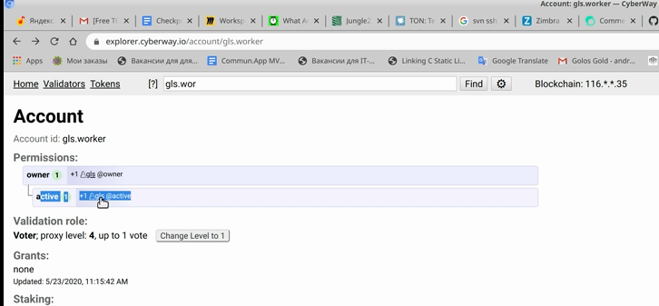
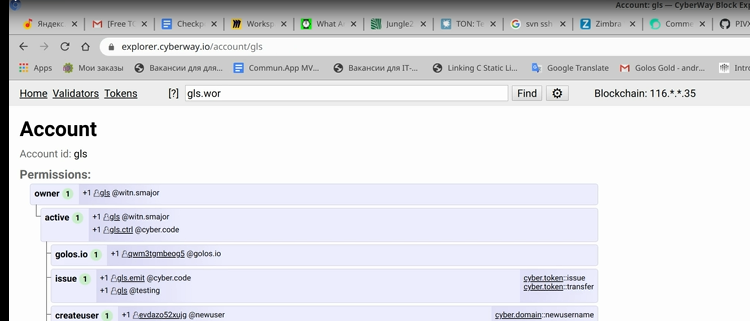
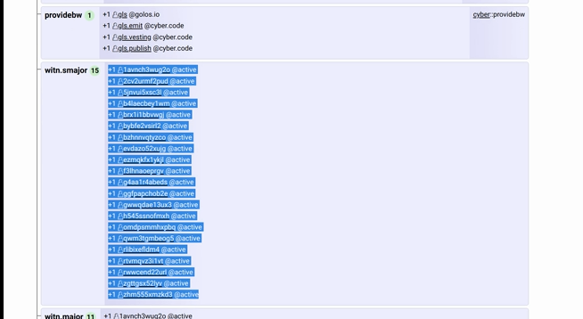
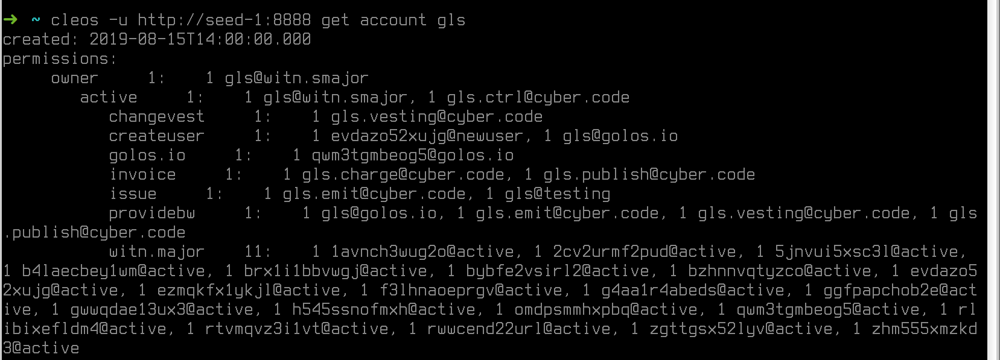
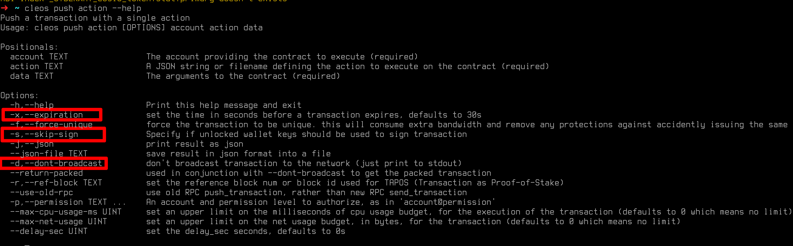

# How To Transfer Tokens To A Worker

### Goal
Create a multi-signature transaction for transferring funds from *gls.worker* account to a worker to pay for finished work. The transaction should be approved by Golos active leaders.

### Before you begin
  * Install the currently supported version of `cleos`.
  * Understand the following:
    * Who is a worker.
    * Who is a Golos application leader.
    * What is a [multisig propose transaction](https://docs.cyberway.io/software_manuals/command_reference/multisig#multisig-propose-transaction).
  

*Worker* - a user directly performing work in accordance with the statement of work. User’s account can be an individual or a group of people.

## Steps

**Step 1** Retrive a list of active leaders with the appropriate authority to create (as well as to sign) proposal transaction to pay a worker his work.  

*Variant 1*  
Retrive the list of active leaders using *JS*.  
Go to `explorer.cyberway.io/account/gls.worker`.  
 

 
In `Permissions` section open the field of active Golos leaders with `gls@witn.smajor` account rights.  
 

 
In the field `active`, account `gls.worker` has an authorization from `gls@active` - that is a list of active leaders. Copy the list of active leaders from `witn.smajor` to separate place.  
 

 
Signatures of these leaders will be necessary to sign proposal transaction.  
  

*Variant 2*  
Retrive the list of active leaders using *cleos* command line.  

Get *gls.worker* authority:
```sh
$ cleos -u http://seed-1:8888 get account gls.worker
```
*Output*
```sh
created: 2019-08-15T14:00:00.00
permissions:
     owner     1:    1 gls@owner
        active     1:    1 gls@active`
memory:
     quota:         0 bytes  used:        0 bytes
```

Get leaders authority:
```sh
$ cleos -u http://seed-1:8888 get account gls
```
*Output*  
 

 

**Step 2** Create proposal transaction.  
To prevent the transaction from becoming `expired` while signatures are being collected, you have to set the transaction expiretime, for example, *14* days that is *1209600* in seconds (*60×60×24×14=1209600*). The maximum allowable time is *45* days.  

For convenience, you can get and use the list of supported options.
```sh
$ cleos push action --help
```
*Output*  
 

 
The most important options are `-x`, `-s` and `-d`.  
The command line looks like:
```sh
$ cleos –u http://seed-1:8888 push action –d –s –x 1209600 cyber.token transfer '{"from":"gls.worker", "to":"shwojevqcywn", "quantity":"1000.000 GOLOS", "memo":""}' –p gls.worker –bandwidth-provider gls.worker/gls
```

*Output*  
 

 
Copy the transaction output code to a separate file (i.e. `worker.trx`).  

**Step 3** Form a list of signatories.  
Retrive a list of active leaders who have right to sign a transaction. This list can be retrieved from the *gls* account authorization:
```sh
$ cleos –u http://seed-1:8888 get account –j gls
```
From the result output, select and save the list of actors that will look like:
 

 
Convert list of actors to string form like this one `[{"account", "permission"}, ... ,{"account", "permission"}]`.  

*Example*
```sh
[{"actor": "lavnch3wug2o","permission: "active"},{"actor": "2cv2urmf2pud","permission: "active"}, ... ,{"actor": "rtvmqvzi5lvt","permission: "active"}] 
```

**Step 4** Submit the proposal.  
*Variant 1*  
Submit the proposal using *JS*.  
Go to `explorer.cyberway.io/account/cyber.msig/contract`, open the propose tab and fill the fields in.  
 

 
  * `proposer` – an author of proposal, any user can be (`shwojevqcywn` - in our case).
  * `proposal_name` – proposal name (`worker.trans` - in our case).
  * `requested` – kept string of signatories [{...}].
  * `trx` – kept transaction code that is {...}.
  * `description` – some comment.

Enter the proposer name in the authorization field.  
Click `build transaction`.  

*Variant 2*  
Submit the proposal using *cleos* command line:
```sh
cleos -u http://seed-1:8888 multisig propose_trx worker.trans permissions.json worker.trx shwojevqcywn -p shwojevqcywn
```
  * `permissions.json` - the file containing permisions list in JSON form.
  * `worker.trx` - the file containing transaction.


**Step 5** Sign the transaction with your private key and send a link to the transaction to Golos leaders.  
*Variant 1*  
Sign the transaction using *JS*.  
 

 

*Variant 2*  
Sign the transaction using *cleos* command line.
```sh
cleos -u http://seed-1:8888 multisig approve shwojevqcywn worker.trans '{"actor":"shwojevqcywn", "permission":"active"}' -p shwojevqcywn
```

**Step 6** Review the proposal.  
*Variant 1*  
Review the proposal using *JS*.  
Go to `https://explorer.cyberway.io/account/shwojevqcywn/proposals`.  
The list of proposals sent by the proposer account will appear, indicating block number and transaction (worker.trans). Leaders can sign the transaction using this link.  
 

 
Click name `worker.trans` to get actual information about voting process.
 

 
*Variant 2*  
Review the proposal using *cleos* command line:
```sh
$ cleos -u http://seed-1:8888 multisig review shwojevqcywn worker.trans
```
