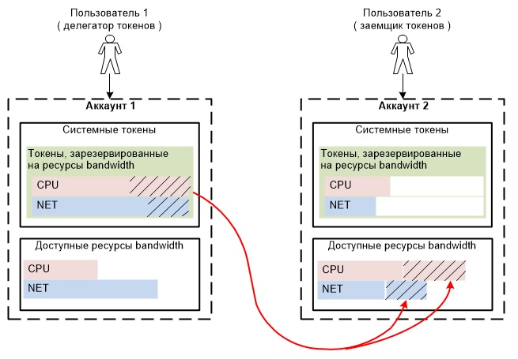
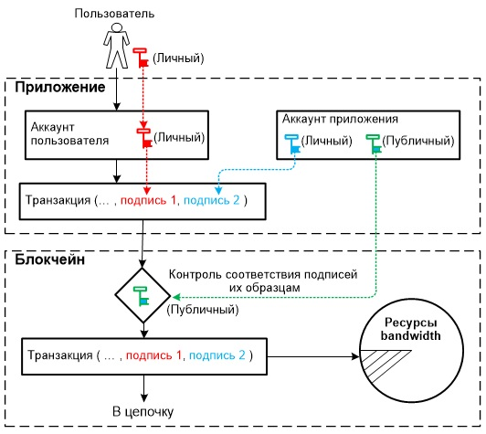
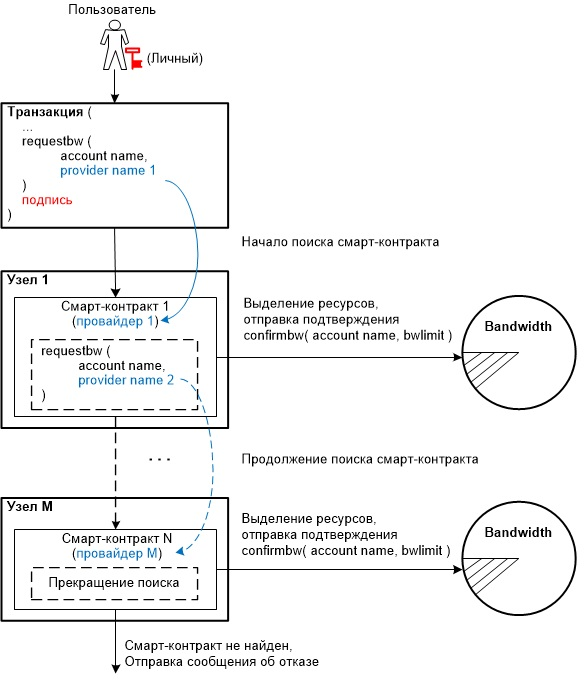

# Отличия в работе подсистем bandwidth на платформах EOS и CyberWay

## Выделение пользователю ресурсов bandwidth в системе EOS

В системе EOS пользователь может выполнять транзакции, если на его балансе достаточное количество системных токенов, зарезервированных (staked) на приобретение ресурсов bandwidth. В случае отсутствия таковых ему может быть выделена доля bandwidth на средства другого пользователя. На рис. 1 в виде структурной схемы показан пример предоставления доли bandwidth пользователю под именем аккаунта 2 за счет средств пользователя под именем аккаунта 1.  

  

Рис. 1 — Структурная схема предоставления доли bandwidth аккаунту 2 на средства аккаунта 1  

На рисунке показано, что на балансе каждого из аккаунтов имеются по две части зарезервированных (staked) системных токенов, одна из которых может быть потрачена на приобретение только ресурсов CPU, другая — только ресурсов NET.  

Аккаунт 1 выделяет (делегирует) долю своих средств ( заштрихованные части), зарезервированных только на использование ресурсов CPU и NET, аккаунту 2. В этом случае выделенные средства будут списаны с баланса аккаунта 1 и зачислены на баланс аккаунта 2 как средства зарезервированные только на использование ресурсов CPU и NET соответственно.  

Операция делегирования зарезервированных средств может быть выполнена в двух вариантах:  
* делегирование в варианте 1 (делегирование собственных ресурсов bandwidth). Делегируемые средства могут быть использованы аккаунтом 2 на приобретение ресурсов bandwidth только аккаунта 1. Делегированная доля bandwidth (CPU, NET) будет добавлена к уже имеющимся у аккаунта 2 ресурсам bandwidth. Аккаунт 2 по истечении определенного времени может отказаться от использования делегированных ему ресурсов bandwidth. В том случае аккаунт 2 не может делегированные ему средства вывести из состояния зарезервированных (staked) в обычные системные токены. Эти средства будут возвращены обратно на баланс аккаунта 1 по истечении трех суток;
* делегирование в варианте 2 (делегирование сторонних ресурсов bandwidth). Делегируемые средства могут быть использованы аккаунтом 2 на закупку ресурсов bandwidth у системы из общих ресурсов. По завершении использования ресурсов bandwidth аккаунт 2 может данные средства вывести из состояния зарезервированных (staked) в обычные системные токены. Эти токены будут зачислены на баланс аккаунта 2 по истечении трех суток.  Аккаунт 1 как бы покупает ресурсы CPU и NET аккаунту 2 и дарит ему системные токены, зарезервированные на закупку этих средств.  
 
Операция делегирования может быть выполнена при условии, что общее количество в системе зарезервированных на приобретение ресурсов bandwidth токенов не меньше установленного порогового значения. Выполнение данного условия контролируется сетью. В случае невыполнения данного условия операция делегирования блокируется. Если данное условие становится невыполнимым уже после проведенной операции делегирования,  возврат токенов будет также блокирован до момента, когда условие вновь станет выполнимым.  


## Выделение пользователю ресурсов bandwidth в системе CyberWay

Активность пользователя в сети ограничивается выделенной ему пропускной способностью — ресурсами bandwidth. С уменьшением объема выделяемых ресурсов bandwidth активность пользователя снижается. Доля bandwidth выделяется пользователю в соответствии со средствами, находящимися на его балансе и зарезервированными на использование bandwidth. Доля bandwidth вычисляется отдельно для ресурсов CPU, NET и RAM. Ресурсы bandwidth находятся на балансе приложения и выделяются пользователю непосредственно при выполнении им транзакции в системе, что обеспечивает динамическое их распределение. Ниже изложены принципы выделения  пользователю ресурсов bandwidth в CyberWay. 

### Выделение ресурсов по принципу разделяемого bandwidth

Распределенное приложение может иметь на своем балансе единый ресурс bandwidth и использовать его как разделяемый bandwidth. В этом случае для выделения пользователю доли bandwidth созданная им транзакция должна быть подписана двумя ключами — личным ключом пользователя и личным ключом аккаунта приложения. Приложением создается пара личного и публичного (англ. private-public) ключей, принадлежащих данному аккаунту.  Личный ключ аккаунта хранится в защищенной части сервиса (веб-сайта), публичный ключ — в блокчейне. Публичный ключ используется для контроля соответствия подписей аккаунтов в транзакции подписям, которые принадлежат зарегистрированным в блокчейне аккаунтам и хранятся в блокчейне как образцовые (рис. 2).  

  

Рис. 2 — Структурная схема выделения ресурсов bandwidth по принципу разделяемого bandwidth  

Выделение пользователю доли bandwidth из общих ресурсов приложения осуществляется по мере необходимости, то есть непосредственно во время проведения пользователем транзакции. Это достигается за счет введения двухподписной транзакции для использования bandwidth. Транзакция может отправиться в цепочку только при наличии подписей двух ключей — личного ключа пользователя и личного ключа аккаунта приложения. Пользователь не может совершать действия без участия приложения, а приложение не может совершать действия без участия пользователя.

### Выделение ресурсов по принципу приоритетного bandwidth

Каждому аккаунту из общих ресурсов bandwidth выделяется на пользование гарантированный процент этих ресурсов в соответствии с количеством заблокированных его системных токенов. Если пользователь для приобретения ресурсов bandwidth выводит значительную сумму системных токенов в состояние заблокированных, общая сумма заблокированных токенов в системе увеличивается и, соответственно, доля используемых ресурсов bandwidth другими пользователями снижается. Следовательно, у других пользователей возникает вероятность нехватки bandwidth для включения их транзакции в очередной формируемый блок, что снижает их активность в системе.  

Чтобы предоставить пользователям равные условия, в CyberWay реализован метод распределения ресурсов по принципу приоритетного bandwidth. Общая полоса пропускания разделяется на две зоны:  
* зона гарантированной полосы пропускания (в классическом EOS-варианте), обеспечивающая выделение аккаунту доли ресурсов в соответствии с его количеством заблокированных токенов;  
* зона приоритетной полосы пропускания, выделяемая аккаунту в соответствии с его приоритетом.  

Пользователь, имеющий значительную сумму системных токенов, может перевести их (частично или в полном объеме) в заблокированное состояние и пользоваться зоной гарантированной полосы пропускания. Пользователь, не имеющий такой возможности, может пользоваться зоной приоритетной полосы пропускания. Порядок включения транзакций в блок в данной полосе пропускания зависит от приоритета аккаунта.   
 
Приоритет аккаунта на момент формирования блока определяется двумя сущностями — приоритетом операций данного аккаунта и количеством уже выполненных у него к этому моменту операций. Пользователь может повысить свой приоритет, заблокировав для этой цели определенное количество системных токенов (большее количество дает более высокий приоритет).  

Приоритет аккаунта снижается по мере выполнения им операций. При одинаковом количестве заблокированных системных токенов наибольший приоритет будет иметь аккаунт, у которого наименьшее количество выполненных операций. Пользователю, выполняющему операции с определенной периодичностью, нет необходимости блокировать системные токены для повышения приоритета выполнения операций.  

Решение о том, в какой пропорции общая полоса пропускания (bandwidth) распределяется между зонами гарантированной и приоритетной полос, принимается валидаторами.


### Выделение ресурсов bandwidth по запросу requestbw

В случае, если у пользователя недостаточно системных токенов, зарезервированных (staked) на приобретение ресурсов bandwidth (или они полностью отсутствуют), он может воспользоваться услугами одного из провайдеров, владеющего такими ресурсами и готовым их предоставить во временное пользование. Для этого пользователю (или самому провайдеру) необходимо в создаваемой им транзакции добавить операцию на предоставление ресурсов bandwidth. Операция имеет следующий вид:
```
requestbw( account name, provider name )
```
Параметры:  
`account name` — имя аккаунта, которому необходимо выделить ресурсы bandwidth;  
`provider name` — имя провайдера, предоставляющего ресурсы bandwidth.  


Операция `requestbw` выполняется непосредственно логикой смарт-контракта на конечном узле провайдера, указанного в запросе. Решение о предоставлении аккаунту ресурсов bandwidth принимается на уровне смарт-контракта. Логика смарт-контракта проверяет наличие имени аккаунта в таблице зарегистрированных пользователей, а также наличие на балансе смарт-контракта необходимого количества зарезервированных (staked) токенов для выделения ресурсов bandwidth. В случае выполнения данных условий указанному в запросе аккаунту разрешается выделить ресурсы bandwidth. Логикой смарт-контракта на полученный запрос высылается подтверждение в виде:
```
confirmbw( account name, bwlimit)
```
Параметры:  
`account name` — имя аккаунта, которому необходимо выделить ресурсы bandwidth;  
`bwlimit` — максимально возможное значение выделяемых аккаунту ресурсов bandwidth.  

Ресурсы bandwidth, необходимые для выполнения транзакции, списываются с баланса смарт-контракта провайдера.  

В случае нехватки у смарт-контракта необходимого количества зарезервированных токенов данный смарт-контракт формирует аналогичный запрос к следующему смарт-контракту, с которым у него имеется соответствующая договоренность по выделению ресурсов bandwidth, запрашивает ресурсы bandwidth у следующего смарт-контракта, с указанием имен аккаунта и провайдера. В случае отсутствия необходимых средств у следующего смарт-контракта формируется аналогичный запрос очередному смарт-контракту. Очередной конкретный смарт-контракт выбирается в соответствии с логикой предыдущего смарт-контракта и их договоренностью о выделении ресурсов. Как только в цепочке запросов обнаруживается смарт-контракт с имеющимися средствами для выделения ресурсов bandwidth, данный смарт-контракт высылает подтверждение `confirmbw`.  

Алгоритм выделения ресурсов bandwidth в виде структурной схемы приведен на рис. 2.  

  

Рис. 3 — Структурная схема алгоритма обработки запроса на выделение ресурсов bandwidth

В случае, если ни один из смарт-контрактов не может выделить ресурсы bandwidth указанному в запросе аккаунту, транзакция не выполняется и пользователю высылается сообщение об отказе.  

Для выполнения  requestbw достаточно в транзакции наличие только одной подписи — личным ключом пользователя.  


## Основные отличия алгоритмов выделения ресурсов bandwidth в EOS и CyberWay
В системе EOS ресурсы bandwidth выделяются приложением всем аккаунтам независимо от их активности. В приложении могут быть пользователи как с высокой, так и с низкой активностью, а также пользователи, отсутствующие в системе длительное время. Выделенные ресурсы bandwidth пользователям с низкой активностью как бы становятся невостребованными, вследствие чего в приложении ограничиваются используемые ресурсы bandwidth, которые могли бы быть выделены на привлечение новых пользователей.  

В отличие от EOS реализованная логика подсистемы bandwidth в CyberWay обеспечивает распределение ресурсов CPU, NET и RAM с учетом степени активности пользователей и наличием оставшихся ресурсов в приложении. Поскольку ресурсы bandwidth находятся на балансе приложения, то в случае появления в системе пользователей с низкой активностью или их исчезновения, решение о перераспределении ресурсов остается за приложением. Поэтому ресурсы bandwidth в CyberWay используются более эффективно.  

В системе EOS выделяемые аккаунту ресурсы bandwidth в части CPU (и аналогично в части NET) вычисляются по формуле
```
CPU_bandwidth = CPU_token / (общее количество CPU_token )
``` 
где  
`CPU_token` — количество зарезервированных системных токенов на балансе аккаунта, выделенных на приобретение доли ресурсов CPU;  
`общее количество CPU_token` — общее количество зарезервированных системных токенов в приложении и выделенных на ресурсы CPU.  

В соответствии с приведенной формулой по мере выделения ресурсов bandwidth новым пользователям выделяемая доля очередному пользователю будет уменьшаться. Следовательно, для сохранения объема выделяемой доли bandwidth очередному пользователю необходимо увеличивать количество `CPU_token`. При наличии в приложении значительного количества неактивных пользователей снижается эффективность использования ресурсов bandwidth.  

В системе CyberWay выделяемые аккаунту ресурсы bandwidth в части CPU (NET) вычисляются аналогично в соответствии с приведенной формулой. В отличие от EOS ресурсы bandwidth не закрепляются за пользователями и находятся на балансе приложения. Операции выполняются за счет приложения. Пользователям с низкой активностью выделяется минимальное количество ресурсов. В случае появления в системе пользователей с высокой активностью или нехватки ресурсов недостающая их часть выкупается у системы.  

## Выводы
Несмотря на то, что в обоих системах EOS и CyberWay реализованы подсистемы bandwidth, логика их работы имеет существенное различие. Подсистема bandwidth в CyberWay реализована с учетом существующих недостатков в логике подсистемы bandwidth в EOS. В CyberWay реализованы методы, обеспечивающие использование ресурсов узлов (нод) более оптимально.  


