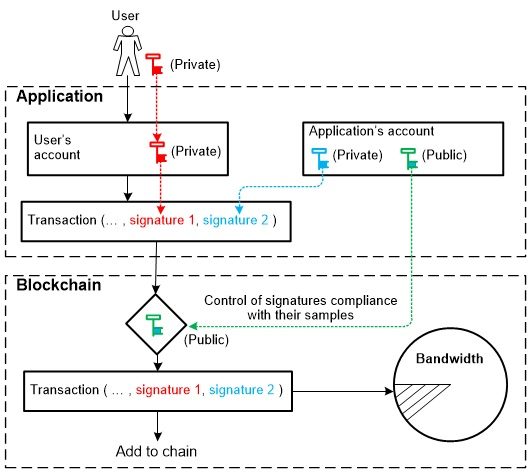
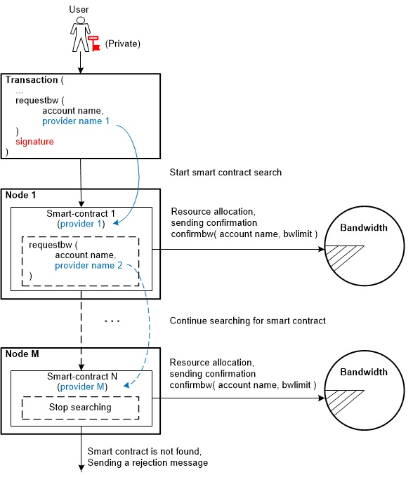

# Understanding the differences between the operation process of bandwidth subsystems on EOS and CyberWay platforms

## Allocation of bandwidth resources to the user within the EOS system

EOS users can perform transactions having a sufficient number of staked system tokens on his own balance suited for bandwidth acquisition. In the absence of these tokens they may be allocated a share of bandwidth for funds of another user. In fig. 1 a structural diagram describes a case of providing a bandwidth share to a user under the account name №2 at the expense of the user’s funds under the account name №1.  

  
  


The fig. 1 clarifies that there are two parts of staked system tokens on the balance of each account, one of which can be spent on CPU resources acquisition only while the other — the acquisition of NET resources.  

Account №1 allocates (i.e. delegates) a share of its funds (see shaded parts of the scheme) reserved only for the use of CPU and NET resources to account 2. In this case, the allocated funds will be withdrawn from balance of the account №1 and credited to the balance of the account №2 as resources reserved for the use of resources CPU and NET respectively only.  

Proceeding the delegation of reserved funds can be executed in two versions:

  *  **allocation in option 1** (allocation of own bandwidth resources). Funds allocated can be used by account 2 for the acquisition of bandwidth resources of account 1 only. The delegated share of bandwidth (CPU, NET) will be added to the 2 bandwidth resources already held by the account. Account 2 after a certain time may refuse to use the bandwidth resources delegated to it. In that case, account 2 cannot transfer funds delegated to it from the state of reserved (staked) to normal system tokens. These funds will be returned back to the account 1 balance after three days;
  * **allocation in option 2** (allocation of third-party bandwidth resources). Funds allocated can be used by account 2 to purchase bandwidth resources from the system from shared resources. Upon completion of the use of bandwidth resources, account 2 can remove these funds from the state of reserved (staked) to normal system tokens. These tokens will be credited to the account 2 balance after three days. Account 1 buys the resources of CPU and NET account 2 and gives it system tokens reserved for the purchase of these funds.  

Allocation operation can be performed under the circumstance that the total number of tokens reserved for acquiring bandwidth resources to the system is not less than the established threshold value. The fulfillment of this condition is controlled by the network. If this condition is not met, the delegation operation is blocked. If this condition becomes impracticable after the delegation operation, the return of tokens will also be blocked until the condition becomes fulfilled again.  


## Allocation of bandwidth resources to the user in CyberWay system
User activity in the network is limited by the bandwidth allocated to him — the resources of bandwidth. It is decreasing with a reduction of the bandwidth allocated. The bandwidth share is allocated to the user in absolute accordance with the funds on his balance and reserved specifically for the bandwidth use. The bandwidth share for CPU, NET, and RAM resources is calculated separately. Bandwidth resources are located on the application balance and are allocated to the user directly when he performs a transaction in the system which ensures their dynamic distribution. The regulations of bandwidth allocation  to a user in CyberWay are described below.


### Allocation of resources on the principle of shared bandwidth
A distributed application can encompass a single bandwidth on its balance and use it as a shared bandwidth. In this case, to allocate a bandwidth share to the user, the transaction created by it must be signed with two keys — the user's private key and the application's private key. The application creates a pair of private-public keys belonging to this account. The private key of the account is stored in the protected part of the service (website) while the public key is in the blockchain. The public key is used to control the compliance of signatures of accounts in a transaction with signatures that belong to accounts registered in the blockchain and are stored in the blockchain as exemplary (Fig. 2).  
 
 


Fig. 2 — Structural diagram of the allocation of bandwidth resources by shared bandwidth principle  
 
Allocation of the bandwidth share to the user (from the space of application's common resources) is carried out by demand meaning it happens when the user is proceeding a transaction. This achievement is available courtesy double-signature transaction implemented specifically for the bandwidth use. A transaction will fall to the blockchain only in the presence of two key signatures (the user and the application private keys). The user cannot perform any action without the application presence as well as the application cannot perform any action without the presence of the user.
 
### Allocation of resources on the priority bandwidth principle

The amount of the guaranteed bandwidth allocated to the specific account from overall bandwidth is in accordance with the number of system tokens blocked by this account. If the user brings a significant amount of system tokens to the blocked state for acquiring bandwidth the total amount of blocked tokens in the system will consequently increase while the bandwidth share that is in use of the other accounts will decrease. This creates possibility of a bandwidth shortage for the others which will prevent the incorporation of their transaction in the next formed block. That means their activity in the system will be definitely reduced.  

 
All the users must be provided with equal conditions. That’s why CyberWay has implemented a resource allocation method based on the priority bandwidth principle.  

The total bandwidth is divided into two zones:

  * Guaranteed bandwidth zone (EOS classic version) which ensures the allocation of a share of resources to an account according to the number of blocked tokens;
  * Priority bandwidth zone allocated to the account according to accounts’ priority.  

A user who has a considerable amount of system tokens at disposal is able to convert them (partially or fully) to a locked state and use the guaranteed bandwidth zone. A user who does not have this feature can choose the priority bandwidth zone. The order of inclusion of transactions in the unit in this bandwidth depends on the priority of the account.  


The priority of the account at the time of the formation of the block is determined by two mediums: the priority of operations of this account and the number of operations already completed by it at this time. The user can enhance his priority by blocking (i.e. reserving) a certain number of system tokens specifically for this instance (a larger number gives a higher priority).  

Account priority tends to decrease when completing the operations. An account with the least number of completed operations will have the highest priority while having the same number of blocked system tokens at his/her disposal. A user performing operations with a certain periodicity does not need to block system tokens to increase the priority of operations.  

The proportion decision on how total bandwidth is distributed between the guaranteed and priority bands is made by block producers.  

### Delegating the bandwidth resources on requestbw request

A user can use the services of one of the providers who has enough resources to be provided for temporary use (in the event of not having enough system tokens reserved (staked) himself for the bandwidth resources acquisition or even complete absence of any funds). In order to do this, the user (or the provider himself) needs to add an operation of providing bandwidth resources in the transaction created. The operation is as follows:
```
requestbw (account name, provider name)
```
Parameters:
  * `account name` — the name of the account that needs to allocate bandwidth resources;
  * `provider name` — the name of the provider providing bandwidth resources.

requestbw operation is performed directly by the smart contract logic on the provider end node specified in the request. The decision to provide bandwidth resources to an account is made at the smart contract level. The smart contract logic checks the presence of the account name in the table of registered users, as well as the presence on the balance of the smart contract of the necessary number of reserved (staked) tokens to allocate bandwidth resources. If these conditions are met, the account specified in the request is allowed to allocate bandwidth resources. The logic of the smart contract for the received request sends a confirmation in the form:
```
confirmbw (account name, bwlimit)
```
Parameters:
  * `account name` — the name of the account that needs to allocate bandwidth resources;
  * `bwlimit` — the maximum possible value of bandwidth resources allocated to the account.  

The bandwidth resources required to complete the transaction are debited from the balance of the provider's smart contract.  
In case the smart contract does not have the required number of reserved tokens, this smart contract generates a similar request for the next smart contract with which it has an agreement to allocate bandwidth resources, requests bandwidth resources from the next smart contract, indicating the account names and provider. In the absence of the necessary funds for the next smart contract, a similar request is generated for the next smart contract. The next specific smart contract is selected in accordance with the logic of the previous smart contract and their agreement on the allocation of resources. As soon as a smart contract with the available means to allocate bandwidth resources is detected in the request chain, this smart contract sends a confirmation message of `confirmbw`.  

The bandwidth resource allocation algorithm in the form of a block diagram is shown in Fig. 3.




In the event that none of the smart contracts can allocate bandwidth resources to the account specified in the request, the transaction is not performed and the user is sent a refusal message.  

To execute requestbw, it is enough in the transaction to have only one signature — the user's private key.

## Key differences between bandwidth allocation algorithms in EOS and CyberWay

In the EOS system, bandwidth resources are allocated by the application to all accounts, regardless of their activity. The application can have users with both high and low activity, as well as users who have been absent from the system for a long time. The allocated bandwidth resources to users with low activity seem to become unclaimed, as a result of which the bandwidth resources used in the application are limited, which could be allocated to attract new users.  

Unlike EOS, the implemented logic of the bandwidth subsystem in CyberWay provides the allocation of CPU, NET and RAM resources taking into account the degree of user activity and the presence of remaining resources in the application. Since bandwidth resources are on the balance of the application, in the event of users with low activity appearing in the system or disappearing, the decision on the reallocation of resources remains with the application. Therefore, bandwidth resources in CyberWay are used more efficiently.  

In EOS system, the bandwidth resources allocated to the account in the CPU part (and similarly in the NET part) are calculated by the formula:

```
CPU_bandwidth = CPU_token / (total number of CPU_token)
```
Variables:    
  * `CPU_token` — the number of reserved system tokens on the account balance allocated for the acquisition of a share of CPU resources;
  * `total CPU_token` — the total number of reserved system tokens in the application and allocated to CPU resources.  

In accordance with the formula indicated above, as bandwidth resources are allocated to new users, the allocated share to the next user will decrease. Therefore, to save the amount of allocated bandwidth, the next user needs to increase the number of CPU_token. If the application has a significant number of inactive users, the efficiency of using bandwidth resources decreases.  

In the CyberWay system, the bandwidth resources allocated to an account in the CPU (NET) part are calculated similarly in accordance with the above formula. Unlike EOS, bandwidth resources are not assigned to users and are on the balance of the application. Operations are performed by the application. Users with low activity are allocated a minimum amount of resources. In the case of users with high activity or lack of resources in the system, the missing part is purchased from the system.

## Conclusions
Despite the fact that both EOS and CyberWay systems implement bandwidth subsystems, the logic of their work has a significant difference. The bandwidth subsystem in CyberWay is implemented taking into account existing flaws in the logic of the bandwidth subsystem in EOS. CyberWay implements methods that ensure the use of node resources (nodes) more optimally.

*****  
