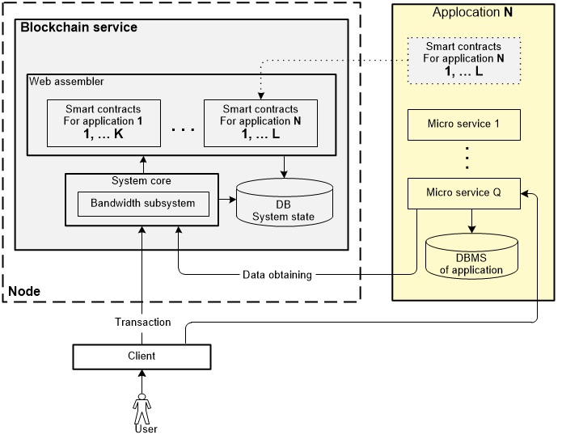
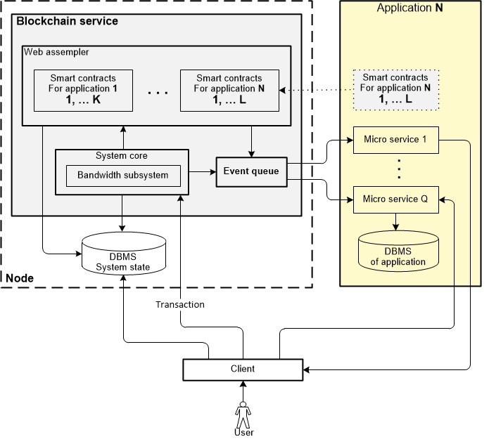

In anticipation of the release of a new blockchain called CyberWay Golos Сore team (the team developing golos.io) informs the community about the key technical provisions of the product. As mentioned previously, CyberWay is a fork of the well-known EOS platform. Keeping in mind that CyberWay inherits some EOS codebase, it's important to take a look at the differences of these two platforms.  

## Reasons for creating CyberWay
EOS is excellent in terms of performance characteristics and smart contracts functionality. However, building applications on top of it without creating additional add-in is impossible.  

Other reasons for choosing a separate way for CyberWay are given below:  

  * High costs of used memory in EOS. As of January 2019 (according to the eosrp.io source), a price for 1 KB of RAM data for storing was around $ 0,571. This means that storing only user data and consensus data on posts and voting results for a week (for a platform like golos.io) might require of at least 400 MB and could cost a minimum of $ 200,000.  

  * EOS smart contract data is stored in a huge hash table in shared memory and access to this data is possible via functions. The disadvantage of this solution is that in this case it is difficult to build search and aggregate queries. As a result the processing of data from this table becomes cumbersome. The most effective solution is to create cache services that would read data from blocks and save them straight to the databases where they can be easily processed. Implementing such a solution directly on the EOS platform is quite complicated.  

  * The EOS system system operates in accordance with the adopted Constitution representing a set of rules for resolving disputes in the form of a textual description (for example, if any user data are not used during 3 years the ownership of them shifts to EOS). It’s obvious that not every community could adopt the current EOS Constitution. That limits the user base of EOS and hinders application development. The EOS platform is focused on creating blocks with a maximum achievable frequency — two blocks per second. Such a high performance can be effective in marketing, but it limits the feasible complexity of smart contracts. CyberWay will meet demand of application developers that prefer reliability over speed (the goal for CyberWay is to have a block per 3 second).  

  * Besides Constitution, EOS has privileged accounts or privileged smart contracts. This could be a code that is associated with the privileged contract, for example, Ricardian contract that could be set as decision maker. Such privileged contracts do restrict decentralization. The resilience to censorship, the lack of a single point of failure and other manifestations of reliability of blockchain technologies are crucial for some applications and businesses. Regardless of general share of such businesses, the choice of a centralized solution as a rule is the way more preferable.  

## Distinctive features of CyberWay and EOS platforms
### Differences in platform architecture

  

  

  

The main differences between EOS and CyberWay:  

  * The difference is in the set of functions that are transferred from smart contracts to the input of web assemblers. CyberWay has its own set of functions coming from smart contracts and used for bandwidth subsystem and data storage. Unlike EOS, CyberWay has event generator. The web assembler does not compile any functions but converts them into calls within blockchain thus creating embedded functions for the event generator.

  * The way of accessing system state data.  
In EOS system state data are stored in a database located directly on the blockchain node. The client does not have any direct access to the database meaning he is forced to contact blockchain node to obtain data. System state data in CyberWay are stored in a database management system (DBMS) and conveniently placed outside the blockchain node.

  * The way of analyzing events and data processing.  
When it comes to EOS, the analysis of events occurring in the blockchain is done via plug-ins. CyberWay has event generator that forms events on operations inside the blockchain and sends them straight to the event queue. Event information is processed by microservices. The structure of the interactions between microservices and the blockchain is client dependent. This allows to build a flexible infrastructure for processing information that appears inside blockchain.

  * The way how bandwidth is allocated.  
Bandwidth resources in EOS are allocated to all accounts regardless of their activity. In the case of low user activity resources allocated to “silent” users are not used. CyberWay bandwidth resources could be allocated to the applications and granted by them to the end users on demand according to the activities of users. This ensures more efficient bandwidth usage.

### Detailing the differences in bandwidth subsystems

The bandwidth subsystem allows the user to perform transactions in accordance with his or her share in the network.  

In EOS system the newbies are given funds to the extent necessary to complete a transaction. It is assumed that any new user knows how to work in the system. He has to have a certain amount of staked tokens on his own balance to execute transactions.  

A newly attracted CyberWay user may not be familiar with the system. He could start using any CyberWay-based application without any tokens in his wallet. When any user-generated transaction happens the application uses its own tokens to put it forward. In this case when user is no longer active no bandwidth resources are blocked.  

If a user is ready to use CyberWay on his own he could buy system tokens and block them for transactions. Once the time has elapsed, the allocated and blocked bandwidth funds can be returned back to the liquid state.  

Unlike EOS, CyberWay is built to attract not only users but applications as well and optimize the allocation of system tokens.  

### Database differences

In EOS system state data are kept directly on a node in the database that construes a separate part of shared memory. This architecture limits the client's operations. The client can not get direct access to the database.  
The applications can only access the database indirectly via EOS node using very primitive set of functions.  
CyberWay system state data are located in the DBMS outside blockchain node, including consensus information. The DBMS is designed to store consensus data only. Big data (English big data) are stored in a separate database and contain all the necessary information about events in the system.  

The access to the mentioned database is implemented via intrinsic functions called by WebAssembler virtual machine. There is no direct compilation of these functions as WebAssembler converts them into calls within the blockchain itself and creates embedded functions. The calls to the event engine are also added to this set of features. Calls for the event generator are also part of this set of functions. a mechanism inside the blockchain into which an arbitrary contract can add its own events (known as data sets) that will be delivered to the new microchip on the external microservice.  

Any of the smart contracts can call a function while generating any event and, therefore, trigger the event generator. The event generator puts the event in the event queue. The events are consequently distributed to their respective recipients in the form of ready-made API calls with operations and parameters.  

The CyberWay architecture is allowing to shape a microservice infrastructure around the blockchain site using the event model. It particularly allows you to implement both repository of social applications texts outside the blockchain and a history of operations performed in the blockchain one.  

Unlike EOS, CyberWay architecture provides the client with flexible access to any of the repositories and grants any information of interest while in EOS each client request leads to a set of queries in the database. CyberWay allows the data needed to be gathered in different blocks. As a result, customers make a request to the database, where the aggregated and processed information is stored.  

This structure makes implementing a repository for texts of social applications outside the blockchain possible, as well as a repository of the history of operations performed in the blockchain.  

## Other differences between CyberWay and EOS
Although CyberWay inherits EOS logic it contains a number of features that distinguish it from EOS. Below are the most important features of CyberWay:  

  * Ability to process long domain names of accounts. Unlike EOS, where a domain name is limited to 12,5 characters, CyberWay limits domain name to 253 characters. The separated part of the domain name could be up to 63 characters. The long domain name allows the applications to offer services. At the same time the hierarchical structure ensures interconnections as the user could have a unique name (alias) within each service.  

  * Set of rules that ensures participation of users in selection of block producers. The users participating in the voting for block producers get remuneration as a percentage of rewards that validators receive for the blocks they oproduce. The users who do not participate in the voting, do not get remuneration, and thus are diluted by inflation the annual percentage of token emissions.  

  * Any user can propose or implement a new functionality for CyberWay thanks to funds allocated for Workers from the reward pool.  

  * The absence of supervisory authority in CyberWay. In EOS, all the rules are specified by a special document — the Constitution. The key decisions are made by ECAF (The EOSIO Core Arbitration Forum) and block producers are obliged to fulfill them. CyberWay does not have any special forums. Thus, all users have equal rights when interacting with the blockchain.  

  * The absence of both "grey" and "black" lists of accounts in Cyber Way. In EOS, block producers have «black» and «gray» lists of users. ECAF can make a ruling and put any user on these lists (taking into account the evidence of his or her malicious actions). A user who is unable to operate on the blockchain. The mentioned lists are synchronized outside the blockchain.  

  * CyberWay plans to increase the number of block producers till 101 in the future in order to create greater decentralization.  

## Ancillary
One of the first applications to be implemented on CyberWay will be the Golos application. This application will be identical to Golos.io in terms of functionality. CyberWay capabilities will be demonstrated basing on this application.
