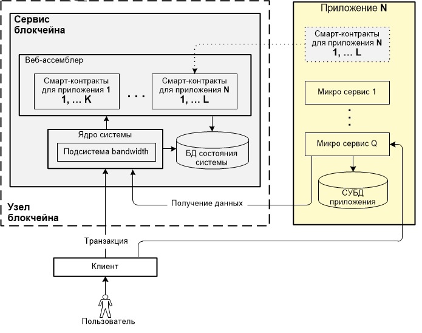
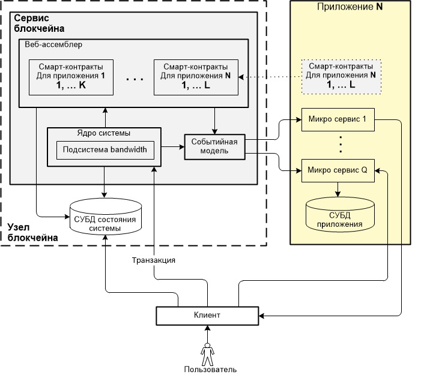

В условиях подготовки к выпуску новой блокчейн-платформы под названием CyberWay команда Голос Кор информирует сообщество о ключевых технических положениях продукта. CyberWay создается на базе логики платформы EOS. Зафиксировав моменты, которые CyberWay наследует от кодовой базы EOS, следует взглянуть на отличия между ними, а также причины создания аргументированно иной автономной платформы.  
 
## Предпосылки создания отдельной платформы CyberWay

Несмотря на то, что платформа EOS является наиболее подходящей для использования ее в качестве базовой, построение непосредственно на ней приложений без создания дополнительной надстройки не представляется возможным. Ниже приводятся причины, по которым было принято решение о создании на логике EOS отдельной платформы CyberWay:  

  * Высокая стоимость используемой памяти в EOS. По данным веб-сайта eosrp.io на январь 2019 г. стоимость памяти RAM за хранение 1 КБ данных составляло $0,571.  С учетом этого, например, на хранение только данных о пользователях и консенсусных данных о постах и результатах голосования за неделю может потребоваться память объемом не менее 400 МБ, на что требуется не менее $200,000.

  * На платформе EOS данные смарт-контрактов сохраняются в хэш-таблице значительного объема в разделяемой памяти. Доступ к этим данным осуществляется с помощью функций. Недостатком такого решения является сложность построения поисковых и агрегирующих запросов, из-за чего обработка табличных данных становится невозможной. В этом случае наиболее эффективным решением является создание кэш-сервисов, чтобы считывать данные из блоков и сохранять их в БД, где они легко обрабатываются. Реализация такого решения непосредственно на платформе EOS затруднена.

  * В EOS система функционирует в соответствии с принятой Конституцией, представляющей собой набор правил по разрешению споров в виде текстового описания (например, если какие-то пользовательские данные, хранящиеся в БД, не используются в течении 3 лет, они переходят во владение EOS). Не каждое сообщество может принять действующую Конституцию EOS, что ограничивает привлечение дополнительных пользователей и, следовательно, создание новых приложений.

  * Платформа EOS ориентирована на создание блоков с максимально достижимой частотой — два блока в секунду. Такая высокая частота создания блоков эффективна в маркетинге, но ограничивает допустимую сложность логики смарт-контрактов, размещаемых на платформе EOS.  Снизив требования по скорости, CyberWay может удовлетворить спрос разработчиков приложений, для которых наиболее важным фактором является не скорость, а надежность.

  * Кроме Конституции, в EOS в качестве контролирующих органов существуют также привилегированные аккаунты, которые могут быть смарт-контрактами. Это программный код с привязкой к определенному привилегированному контракту (например, рикардианский контракт), который может выступать в качестве исполнителя решений. Наличие привилегированного контракта в системе ограничивает возможность децентрализации.  Для некоторых приложений и бизнесов устойчивость к цензуре, отсутствие единой точки отказа и прочие проявления надежности блокчейн-технологии являются критически важными. Несмотря на то, что доля таких бизнесов небольшая и их интересами можно бы было пренебречь, для всех остальных бизнесов, как правило, более выгодным является выбор централизованного решения.

## Отличительные особенности платформ EOS и CyberWay

### Отличия в архитектуре платформ

На рис. 1 и 2 в виде структурных схем показаны платформы EOS и CyberWay.  

  

  

**Основные отличия EOS и CyberWay:** 

  * Отличие в поступающих на вход веб-ассемблеров функций от смарт-контрактов. Отличие в наборе функций, поступающих от смарт-контрактов. Используемые приложениями смарт-контракты физически размещены в веб-ассемблере каждой из платформ. В CyberWay создан свой набор функций, поступающих от смарт-контрактов, в том числе используемых для подсистемы bandwidth и сохранения данных. В отличие от EOS добавлены функции для событийной модели генератора событий. Веб-ассемблер не компилирует функции, а преобразует их в вызовы внутри самого блокчейна, то есть создает встраиваемые функции для событийной модели генератора событий.  

  * Отличие в доступе к данным состояния системы. В EOS данные о состоянии системы хранятся в БД, размещенной непосредственно на сервисе узле блокчейна. Клиент не имеет прямого доступа к БД и для получения данных вынужден обращаться к узлу блокчейна системе через сервисный компонент приложения. В CyberWay данные о состоянии системы хранятся в системе управления базой данных (СУБД) и размещаются вне сервиса  узла блокчейна. Пользователь может получить данные о состоянии системы, обратившись непосредственно к СУБД. 

  * Отличие в способе анализа событий, происходящих в блокчейне. обработки данных. В EOS анализ событий, происходящих в блокчейне, основан на использовании плагинов. В CyberWay создана событийная модель, которая генерирует на основе генератора событий, который формирует события о происходящих внутри блокчейна операциях и передает их в очередь событий. Обработка событийной информации выполняется микросервисами. Структура взаимодействия микросервисов с блокчейнов (по универсальному интерфейсу) полностью зависит от клиента. Это позволяет строить гибкую инфра-структуру по обработке информации, появляющейся внутри цепочки блокчейна.  

  * Отличие в работе подсистем `bandwidth`. В EOS ресурсы `bandwidth` выделяются всем аккаунтам независимо от их активности. В случае появления пользователей с низкой активностью выделенные им ресурсы становятся невостребованными. В CyberWay ресурсы `bandwidth` находятся на балансе приложения и выделяются пользователям с учетом их активности. В случае появления в системе пользователей с низкой активностью решение о перераспределении ресурсов остается за приложением, что обеспечивает их более эффективное использование.  

### Детализация отличий в работе подсистем bandwidth
   
Подсистема bandwidth предоставляет возможность пользователю выполнять транзакции в соответствии с его долей в сети, которой он обладает.  

В EOS вновь привлеченному в систему пользователю делегируются средства в объеме, необходимом для выполнения транзакций. При этом предполагается, что новый пользователь заведомо знаком с условиями работы в системе. На его балансе обязана быть определенная сумма токенов, выделенная и заблокированная (от англ. staked) на выполнение транзакций.  

В CyberWay вновь привлеченный в систему пользователь может быть незнаком с условиями работы системы. Изначально в кошельке пользователя могут отсутствовать токены необходимые на выполнение транзакций. Во время выполнения транзакций приложение само выделяет новому пользователю необходимую для этого сумму средств из своего кошелька. При этом средства приложения блокируются на время работы пользователя в системе. По истечении времени, когда потребность у пользователя в системе исчезает, средства выводятся из системы.  

Для увеличения bandwidth пользователь CyberWay также должен выкупить системные токены и заблокировать их на выполнение транзакций. По истечении времени выделенные и заблокированные на bandwidth средства могут обратно быть ликвидными.  

В отличие от EOS система bandwidth на платформе CyberWay ориентирована не только на привлечение нового пользователя в систему, но также на оптимизацию расходов делегированных пользователю средств.  

### Детализация отличий в базах данных

В EOS данные о состоянии системы находятся непосредственно на сервисе блокчейна узле в БД, представляющей собой отдельную часть разделяемой памяти (англ. shared memory). Такая архитектура ограничивает клиента в выполняемых им операциях. Клиент не может получить прямой доступ к БД состояния системы. Он вынужден обращаться к сервисному компоненту приложения узлу блокчейна ЕОS, который предоставляет примитивный интерфейс для выборки записей, при этом только из одной таблицы БД состояния системы в указанном диапазоне значений.  
 
В CyberWay данные о состоянии системы находятся в СУБД, размещенной вне сервиса блокчейна узла блокчейна. В СУБД состояния системы хранится только консенсусная информация.  Большие данные (англ. big data) хранятся в отдельной БД СУБД приложения и содержат всю необходимую информацию о событиях в системе.  

Информация о событиях, происходящих внутри блокчейна, сохраняется в СУБД приложения. Данное хранилище БД событий  реализовано в виде встроенных функций (англ. intrinsic function), вызываемых из виртуальной машины веб-ассемблера. Непосредственно компиляции этих функций не происходит, веб-ассемблер преобразует их в вызовы внутри самого блокчейна — создает встраиваемые функции. В этот набор функций также добавляются вызовы для событийной модели.  генератора событий (англ. event engine) — механизм внутри блокчейна, в который произвольный контракт может складывать свои события (наборы данных), которые будут доставлены на внешний микросервис. Событийная модель представляет собой компонент, регистрирующий события, происходящие внутри блокчейна, на основе поступающих наборов данных от смарт-контрактов. Любой из смарт-контрактов может вызвать функцию, сформировать очередное событие и вызвать событийную модель. Событийная модель фиксирует событие, встраивает его в очередь событий для доставки на внешний микросервис. События из очереди событий распределяются по соответствующим адресатам, в виде готовых API-вызовов с указанием операций и параметров.  

Любой из смарт-контрактов может вызвать функцию, сформировать какое-то событие и, следовательно, вызвать генератор событий. Вызов генератора событий формирует очередное событие и поставит его в очередь событий. Далее эти события распределяются по соответствующим адресатам, в виде готовых API-вызовов с указанием операций и параметров.  

Микросервис - это процесс, который встроен в инфраструктуру и используется для  занимается обработкойи данных. В частности, в случае с CyberWay посредством микросервисов могут быть реализованы клиентские приложения. Один из частных случаев - это взаимодействие блокчейна с СУБД приложения БД событий посредством микросервиса.  

Такая структура позволяет построить более гибкую инфраструктуру рядом с сервисом блокчейна нодой БЧ. В EOS при обращении к данным хранилища используются примитивные запросы. Для получения клиенту необходимых данных каждый его запрос приводит к множеству запросов в СУБД приложения. В CyberWay необходимые клиентам данные помещаются в каждый блок. Клиент может обратиться к СУБД приложения, где уже хранится агрегированная и обработанная информация. Для получения клиенту необходимых данных формируется всего один запрос в СУБД приложения.  

В случае с EOS каждый запрос клиента приводит к множеству запросов в БД приложения. В случае с CyberWay нужные клиентам данные собираются в каждый блок. В итоге клиенты делают запрос к БД, где хранится агрегированная и обработанная информация.  

Предложенная структура, в частности, позволяет реализовать хранилище для текстов социальных приложений вне сервиса блокчейна, а также хранилище истории совершенных в блокчейне операций.  

## Другие возможности платформы CyberWay и отличия ее от EOS

Несмотря на то, что платформа CyberWay разработана на базе логики EOS, она содержит ряд функциональных возможностей, отличающих ее от EOS. Ниже приводятся наиболее важные особенности CyberWay: 

  * Возможность обработки длинных доменных имен аккаунтов. В отличие от EOS, где доменное имя ограничивается длиной в 12,5 символов, в CyberWay длина доменного имени составляет 253 символа. Длина отдельной части доменного имени составляет 63 символа.Наличие длинного доменного имени предоставляет возможность предлагать сервисы внутри приложений. При этом иерархическая структура позволяет обеспечить взаимосвязи - внутри каждого сервиса пользователь сможет иметь уникальное имя — алиас.

  * Наличие условий, способствующих участию пользователей в выборе блок-продюсеров.  Пользователи, принимающие участие в голосовании за блок-продюсеров, получают процентное отчисление от вознаграждения блок-продюсеров за создаваемые ими блоки цепочки. Пользователи, не принимающие участие в голосовании, процентное отчисление от вознаграждения блок-продюсеров не получают. Стоимость их средств снижается на годовой процент эмиссии токенов.

  * Возможность пользователю вносить предложение по улучшению функционирования или самостоятельно реализовывать предложенную им новую функциональную возможность в CyberWay за счет средств, выделяемых из пула воркеры.  
  
  * Отсутствие в CyberWay контролирующего органа. В EOS все правила устанавливаются специальным документом – Конституцией, в которой говорится о наличии контролирующего органа в системе. Решения вносит ECAF (сокр. EOS Core Arbitration Forum – Арбитражный Форум в EOS по разрешению споров), а блок-продюсеры обязаны их выполнять. При этом пользователи и разработчики могут предъявить аргументы и вправе создать и использовать другие арбитражные форумы.  В отличие от EOS в CyberWay нет контролирующего органа, и все пользователи CyberWay имеют одинаковые возможности в работе с смарт-контрактами.  
  
  * Отсутствие в CyberWay «серого» или «черного» списков аккаунтов. В EOS у блок-продюсеров имеются «черный» и «серый» списки пользователей, которые формируются на основе информации о репутации пользователя (репутация пользователя формируется путем подачи заявления в  ECAF с предъявлением доказательств злонамеренных действий пользователя). Эти списки синхронизируются вне блокчейна. В случае попадая пользователя в указанные списки у него возникают сложности с работой внутри блокчейна, узел блокчейна может игнорировать транзакции, подписанные аккаунтом с негативной репутацией. 

  * С целью создания большей децентрализации системы предусматривается в дальнейшем увеличение количества блок-продюсеров на платформе CybeWay до 101 включительно.  

## Дополнение

Одним из первых приложений, которое будет реализовано на блокчейн-платформе CyberWay в качестве образцового, станет приложение Голос. Это приложение будет представлять собой платформу Голос с сохранением всех ее функциональных возможностей. На основе этого приложения Голос будут демонстрироваться возможности новой платформы CyberWay.  

