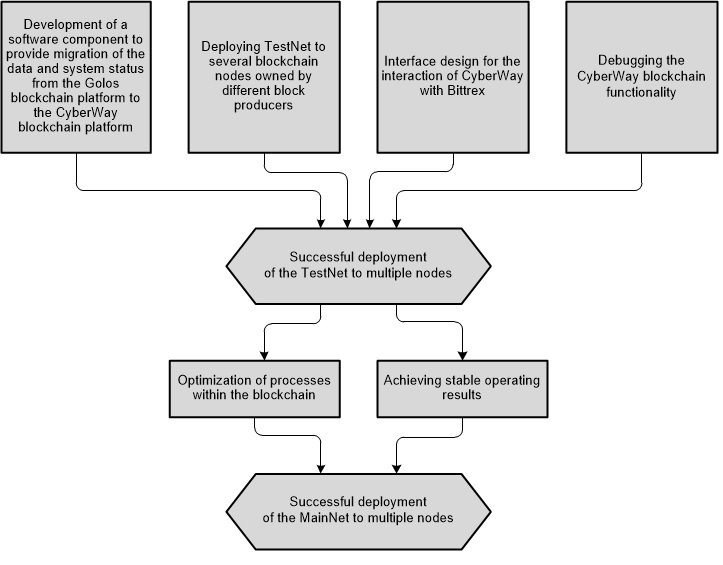
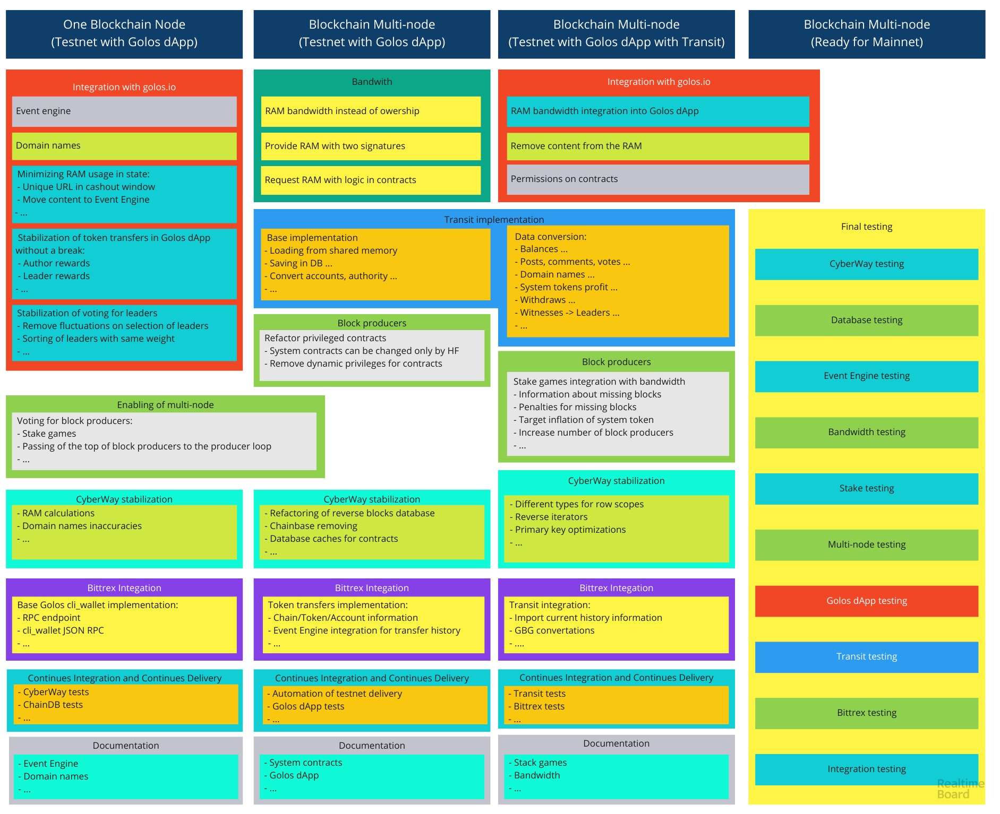

## CyberWay goals
The main goal of the project is to create new CyberWay blockchain platform based on EOS logic that has:  

  * decentralized governance: stakers (vote for validators), validators (run blockchain), workers (build blockchain);

  * in-build rights guaranteed by technology: blockchain assets belong to users, every user has a right to make a transaction, smart contracts are executed upon payment;  

  * application-friendly: free user onboarding, claim for bandwidth from application developers, free transactions.  

CyberWay blockchain is the protocol that enables development of applications that are built on individual smart contracts; thus are flexible in terms of business logic. It lacks censoring and is free of God’s mode of EOS.  

## Main project stages:  

**Stage 1:** blockchain development and development of Golos application (golos.io) on CyberWay smart contracts. Data migration from Golos blockchain platform to CyberWay.  

**Stage 2:** blockchain development and development of other applications based on smart contracts developed for the Golos application.  

** List of works for stage 1:**  

1 Analysis of the EOS blockchain platform functionality.  
2 Development of environment for CyberWay based on EOS logic (fork).  
3 CyberWay platform architecture development.  
4 Smart contracts development for the CyberWay platform.  
5 Development and deployment of MainNet.  

Fig 1 and 2 show the sequence of actions for CyberWay development.  
The work outlined is to be finished in April if no obstacles will take place.  

  

  
